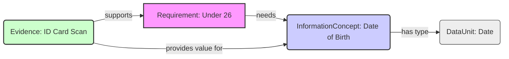
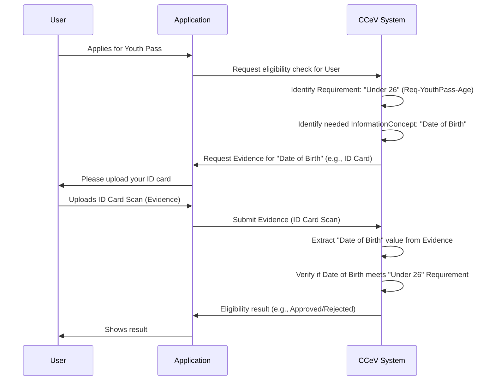

# Chapter 1: CCCEV Core Vocabulary (Requirement, Evidence, InformationConcept)

Welcome to the `trace-cccev` tutorial! If you've ever wondered how systems check if rules are met, verify information, or manage requirements and the proof needed for them, you're in the right place. This project helps build systems that do exactly that, often in contexts like certifications, applications, or compliance checks.

Imagine you're applying for a youth travel pass. The main rule is usually something like "You must be under 26 years old". How does the travel company's system check this?

1.  It needs to know the **rule** (the requirement): "Applicant must be under 26".
2.  It needs to know *what specific information* proves this: the applicant's "Date of Birth".
3.  It needs the actual **proof** (the evidence): maybe a scan of your ID card.
4.  Finally, it needs to **verify** if the Date of Birth on the ID card means you're under 26.

This process of defining rules, identifying needed information, and using evidence to verify them is common in many digital services. The **Core Criterion and Core Evidence Vocabulary (CCCEV)** standard provides a common language and structure to describe these elements. Think of it like learning the basic grammar (nouns, verbs, adjectives) before writing sentences.

In this chapter, we'll explore the absolute fundamentals of CCCEV used in `trace-cccev`: `Requirement`, `Evidence`, and `InformationConcept`.

## The Core Concepts: Building Blocks of CCCEV

CCCEV gives us three main building blocks:

1.  **Requirement:** This is the rule, the question, or the condition that needs to be met or checked.
    *   *Analogy:* A question in a form ("Are you over 18?") or a task in a checklist ("Provide proof of address").
    *   *Example (Youth Pass):* "Applicant must be under 26 years old."
    *   *CCCEV Definition:* "[A condition or prerequisite that is to be proven by Evidence.](https://semiceu.github.io/CCCEV/releases/2.00/#Requirement)" Requirements can be simple checks (`InformationRequirement`), evaluation criteria (`Criterion`), or specific limitations (`Constraint`). For now, just think of it as the rule.

2.  **InformationConcept:** This is the specific *piece of information* that a `Requirement` needs, or that an `Evidence` provides.
    *   *Analogy:* The specific blank field on a form ("Date of Birth", "City Name", "Annual Income").
    *   *Example (Youth Pass):* To check the "Under 26" requirement, we need the "Date of Birth". "Date of Birth" is the `InformationConcept`.
    *   *CCCEV Definition:* "[Piece of information that the Evidence provides or the Requirement needs.](https://semiceu.github.io/CCCEV/releases/2.00/#Information%20Concept)"
    *   **DataUnit:** Every `InformationConcept` has a specific *type* of data, called a `DataUnit`. This tells us if the information is a date, a number, text, true/false, etc.
        *   *Example (Youth Pass):* The `InformationConcept` "Date of Birth" has a `DataUnit` of "Date". An `InformationConcept` like "Age" would have a `DataUnit` of "Number".
        *   *CCCEV Reference:* Although not a direct CCCEV class, it aligns with the `InformationConcept.type` and expected value format. In `trace-cccev`, `DataUnit` provides this structure.

3.  **Evidence:** This is the actual *proof* or *answer* provided to satisfy a `Requirement`.
    *   *Analogy:* The document you upload (ID scan, certificate PDF) or the answer you type into a form.
    *   *Example (Youth Pass):* A scan of your national ID card or passport is the `Evidence`. This document contains the "Date of Birth" (`InformationConcept`) needed to verify the "Under 26" (`Requirement`).
    *   *CCCEV Definition:* "[Proof that a Requirement is met.](https://semiceu.github.io/CCCEV/releases/2.00/#Evidence)"

## How They Work Together: The Youth Pass Example

Let's see how these fit together for our youth pass application:



1.  We start with the **Requirement** (pink box): "Applicant must be under 26".
2.  This Requirement tells us we *need* a specific **InformationConcept** (blue box): "Date of Birth".
3.  The "Date of Birth" InformationConcept has a specific **DataUnit** (grey box): it must be a "Date".
4.  The applicant provides **Evidence** (green box): an "ID Card Scan".
5.  This Evidence *provides a value for* the "Date of Birth" InformationConcept and *supports* the overall "Under 26" Requirement. The system can now extract the date from the evidence and check if it meets the requirement.

## Representing Concepts in Code (Simplified View)

In `trace-cccev`, these concepts are represented using Kotlin data structures, primarily defined in the `cccev-dsl-model` module. Here's a very simplified glimpse:

**Requirement:**

```kotlin
// Simplified representation of a Requirement
interface Requirement {
    val identifier: String // e.g., "Req-YouthPass-Age"
    val name: String?      // e.g., "Age Requirement for Youth Pass"
    val kind: String       // e.g., "INFORMATION", "CRITERION"
    // Specifies which pieces of information are needed
    val hasConcept: List<InformationConceptDTO>?
    // ... other properties like description, sub-requirements
}
```

This defines the basic structure of a rule, including its unique identifier, name, type (`kind`), and what information (`hasConcept`) it relies on.

**InformationConcept:**

```kotlin
// Simplified representation of an InformationConcept
interface InformationConceptDTO {
    val identifier: String    // e.g., "Concept-DateOfBirth"
    val name: String          // e.g., "Date of Birth"
    val unit: DataUnitDTO     // Specifies the type of data (see below)
    // ... other properties like description
}
```

This defines a specific piece of information, like "Date of Birth", linking it to its data type (`unit`).

**DataUnit:**

```kotlin
// Simplified representation of a DataUnit
interface DataUnitDTO {
    val identifier: String    // e.g., "xsdDate"
    val name: String          // e.g., "XSDDate"
    val type: DataUnitType    // e.g., DataUnitType.DATE, .NUMBER, .STRING
    // ... other properties like description, options for dropdowns
}
```

This specifies the *type* of data for an `InformationConcept`, like `DATE`, `NUMBER`, or `STRING`.

**Evidence:**

```kotlin
// Simplified representation of Evidence
interface EvidenceDTO {
    val identifier: String    // Unique ID for this piece of evidence
    val name: String          // e.g., "Applicant ID Card Scan"
    val file: String?         // Link or reference to the actual file/data
    // Links to the concepts/requirements it provides proof for
    val supportsConcept: List<InformationConceptId>?
    val supportsRequirement: List<RequirementId>?
    // ... other properties like validity period
}
```

This represents the submitted proof, linking to the actual file/data and indicating which requirements or concepts it supports.

*(Code snippets are simplified versions based on files like `Requirement.kt`, `InformationConceptDTO.kt`, `Units.kt`, and `Evidence.kt` in `cccev-dsl/cccev-dsl-model`)*

## What Happens Under the Hood? (A Simple View)

These concepts aren't just definitions; they drive actions in the system. Imagine our youth pass check again:



This simplified flow shows how the `Requirement`, `InformationConcept`, and `Evidence` concepts guide the process of requesting information, collecting proof, and making a decision.

The `trace-cccev` project provides tools and building blocks to implement such flows. The DSL models we saw (`Requirement`, `InformationConceptDTO`, `EvidenceDTO`, `DataUnitDTO`) define the structure of the data. How this data is stored (e.g., in a database) is handled by persistence layers, which we'll touch upon in [Chapter 6: Neo4j Graph Persistence (Entities & Repositories)](06_neo4j_graph_persistence__entities___repositories__.md). The actual process logic (like requesting evidence and verifying it) is built using other parts of the framework, explored in chapters like [Chapter 2: Certification Process & Entities](02_certification_process___entities_.md) and [Chapter 5: Aggregate Services (Core Business Logic)](05_aggregate_services__core_business_logic__.md).

## Conclusion

You've just learned the fundamental "grammar" of `trace-cccev`, based on the CCCEV standard:

*   **Requirement:** The rule or question (e.g., "Under 26").
*   **InformationConcept:** The specific piece of information needed (e.g., "Date of Birth").
*   **DataUnit:** The type of that information (e.g., "Date").
*   **Evidence:** The proof provided (e.g., "ID Card Scan").

These concepts are the essential building blocks used throughout the system to define criteria, request data, and manage proof.

Now that we understand this basic vocabulary, let's move on to see how these pieces are used in a more structured way within a typical process.

Next up: [Chapter 2: Certification Process & Entities](02_certification_process___entities_.md)

---

Generated by [AI Codebase Knowledge Builder](https://github.com/The-Pocket/Tutorial-Codebase-Knowledge)