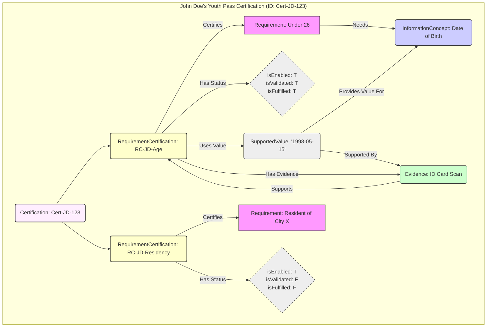
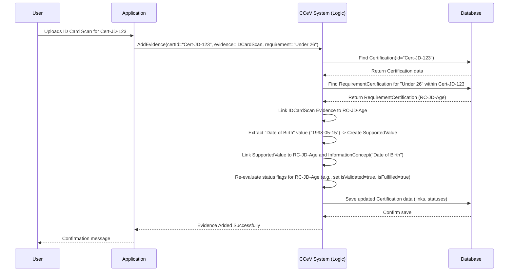

# Chapter 2: Certification Process & Entities

In [Chapter 1: CCCEV Core Vocabulary (Requirement, Evidence, InformationConcept)](01_cccev_core_vocabulary__requirement__evidence__informationconcept__.md), we learned about the basic building blocks: the `Requirement` (the rule), the `InformationConcept` (the needed data), and the `Evidence` (the proof). These are like the raw ingredients.

But how do we actually use these ingredients to check if someone, say, qualifies for our Youth Pass? We need a *process* – a way to track which requirements apply to a specific application, what evidence has been submitted for *that* application, and whether each requirement is met *in that context*.

Imagine you're not just defining "Under 26" in general, but checking if *specifically John Doe* meets this rule for *his* Youth Pass application submitted today. This is where the Certification process and its associated entities come in.

## The Need: Tracking a Specific Check

Think about the Youth Pass office. They handle hundreds of applications. Each application needs to be checked against the same rules (Requirements), but the *status* and *evidence* are unique to each applicant.

*   **Problem:** How do we manage and track the verification status for *each individual application*? We need something to bundle together all the checks for John Doe, separate from the checks for Jane Smith.
*   **Solution:** We introduce the concept of a `Certification` and `RequirementCertification`.

## Key Concepts: The Certification Folder and Checklist

Let's break down the main parts of this process:

1.  **Certification:** This is the main container for a *single instance* of verification. Think of it as the application folder for John Doe's Youth Pass request. It holds everything related to checking *his* eligibility.
    *   *Analogy:* A physical file folder labelled "John Doe - Youth Pass Application - Oct 26".
    *   *Purpose:* Groups together all the specific checks (`RequirementCertification`s) needed for one subject (like John Doe) regarding one objective (like getting the Youth Pass).

2.  **RequirementCertification:** This represents the status of *one specific Requirement* within a particular `Certification`. It links the general rule (like "Under 26") to the specific evidence and values provided by John Doe, and tracks whether *he* satisfies it.
    *   *Analogy:* A checklist item inside John Doe's folder. E.g., "[ ] Check: Under 26. Proof: ID Card Scan. Result: Verified."
    *   *Purpose:* Tracks the state (enabled? validated? fulfilled?) of a single requirement *for this specific certification instance*. It connects the abstract `Requirement` to concrete `Evidence` and `SupportedValue`s.
    *   **Key Status Flags:**
        *   `isEnabled`: Is this check even applicable right now? (Maybe some checks only apply if others are met first).
        *   `isValidated`: Does the provided information/evidence meet the rule's conditions? (e.g., Is the date of birth actually under 26 years ago?).
        *   `hasAllValues`: Have we received all the necessary pieces of information (`InformationConcept`s) needed for this check?
        *   `isFulfilled`: Is this specific requirement fully satisfied (considering `isEnabled`, `isValidated`, `hasAllValues`, and maybe sub-requirements)?

3.  **SupportedValue:** This entity holds the actual *data value* that supports an `InformationConcept` within a `RequirementCertification`. It's the concrete piece of information extracted or provided.
    *   *Analogy:* The specific date "1998-05-15" written down on the checklist form for John Doe's "Date of Birth".
    *   *Purpose:* Stores the actual value used for validation, linking it to the concept it represents and the evidence it came from.

4.  **Evidence (in context):** As we saw in Chapter 1, this is the proof. In this context, `Evidence` is linked to one or more `RequirementCertification`s it helps satisfy, and it's the source for `SupportedValue`s.
    *   *Analogy:* The actual ID card scan document placed inside John Doe's folder, referenced by the checklist item.

## How They Fit Together: John Doe's Youth Pass

Let's revisit the Youth Pass example for John Doe:



1.  We start a `Certification` (pinkish box) for John Doe's application (Cert-JD-123).
2.  This `Certification` links to specific `RequirementCertification`s (yellow boxes) for each rule that applies, like "Under 26" (RC-JD-Age) and "Resident of City X" (RC-JD-Residency).
3.  Each `RequirementCertification` (e.g., RC-JD-Age) links to the general `Requirement` it's checking (pink, "Under 26").
4.  When John submits his ID Scan (`Evidence`, green), it's linked to RC-JD-Age.
5.  The system extracts his Date of Birth ("1998-05-15") as a `SupportedValue` (grey), linking it to the required `InformationConcept` ("Date of Birth", blue) and the `Evidence` it came from.
6.  The system updates the status flags (dashed grey box) for RC-JD-Age. Since the date confirms he's under 26, `isValidated` becomes true. If all conditions are met, `isFulfilled` becomes true.
7.  The process repeats for other requirements like "Resident of City X" (RC-JD-Residency). Maybe this one is not yet fulfilled (`isFulfilled: F`).

The overall `Certification` (Cert-JD-123) is considered complete or successful only when all its required `RequirementCertification`s are fulfilled.

## Representing Certification Entities in Code (Simplified)

Let's look at how these concepts might appear in the code structure, based on the provided context files.

**Certification:** This groups the individual requirement checks.

```kotlin
// Simplified from cccev-dsl-model/.../Certification.kt
// Represents the overall 'folder' for a specific verification case.
@Serializable
data class Certification(
    val id: CertificationId, // Unique ID for this specific certification case
    // List of specific checks/statuses for each requirement in *this* case
    val requirementCertifications: List<RequirementCertification>
)
```
This Kotlin data class defines a `Certification`. It has a unique `id` (like "Cert-JD-123") and holds a list of `RequirementCertification` objects, representing the status of each rule for this specific case.

**RequirementCertification:** This tracks the status of one rule within the Certification.

```kotlin
// Simplified from cccev-dsl-model/.../RequirementCertification.kt
// Represents one checklist item status within a Certification 'folder'.
@Serializable
class RequirementCertification(
    val id: RequirementCertificationId, // Unique ID for this specific check status
    val requirement: Requirement,       // The general rule being checked (from Chapter 1)
    val values: List<SupportedValue>,   // Specific values provided for *this* check
    // Status flags for *this* check instance
    val isEnabled: Boolean,
    val isValidated: Boolean,
    val hasAllValues: Boolean,
    val isFulfilled: Boolean
    // Simplified: Missing subCertifications, evidence links for brevity
)
```
This class defines a specific check (`RequirementCertification`). It has its own `id`, links to the general `Requirement`, holds the specific `SupportedValue`s provided for this instance, and tracks its `isEnabled`, `isValidated`, `hasAllValues`, and `isFulfilled` status.

*(Code snippets are simplified versions based on `Certification.kt` and `RequirementCertification.kt` in `cccev-dsl/cccev-dsl-model`, and related entities in `cccev-core`)*

## What Happens Under the Hood? (Adding Evidence)

Let's trace what happens when John Doe uploads his ID card (`Evidence`) for his Youth Pass `Certification`.



1.  The User uploads the ID card via the Application.
2.  The Application tells the CCeV System (specifically, logic potentially in the [Aggregate Services](05_aggregate_services__core_business_logic__.md)) to add this evidence to John's specific certification (`Cert-JD-123`) for the "Under 26" requirement.
3.  The System fetches the `Certification` and the relevant `RequirementCertification` (RC-JD-Age) from the [Database](06_neo4j_graph_persistence__entities___repositories__.md).
4.  It links the new `Evidence` (ID Card Scan) to RC-JD-Age.
5.  It might extract the "Date of Birth" value, creating a `SupportedValue` ("1998-05-15") and linking it appropriately.
6.  Crucially, it recalculates the status flags (`isEnabled`, `isValidated`, `hasAllValues`, `isFulfilled`) for RC-JD-Age based on the new information.
7.  It saves these updates back to the Database.

## Deeper Dive into Implementation Code

The core logic for handling these operations often resides in services like `CertificationAggregateService`. Let's look at a highly simplified view of how adding evidence might be handled, referencing the provided files.

```kotlin
// Simplified concept from cccev-core/.../CertificationAggregateService.kt
class CertificationAggregateService(
    /* ... dependencies like repositories ... */
) {
    suspend fun addEvidence(command: CertificationAddEvidenceCommand, /*... file data ...*/) {
        // 1. Find the specific RequirementCertification being targeted
        val reqCert = certificationRepository.findRequirementCertification(
            command.id, // Certification ID (e.g., "Cert-JD-123")
            command.requirementCertificationId // Specific check ID (e.g., "RC-JD-Age")
        ) ?: throw NotFoundException(...)

        // 2. Create and link the new Evidence entity
        val evidence = // ... create EvidenceEntity from command & file data ...
        reqCert.evidences.add(evidence)

        // 3. (Potentially) Create/Update SupportedValue(s) based on evidence
        // val value = extractValueFromEvidence(evidence, reqCert.requirement)
        // val supportedValue = // ... create SupportedValueEntity ...
        // reqCert.values.add(supportedValue)

        // 4. Re-evaluate the status flags for this RequirementCertification
        reqCert.isValidated = checkValidation(reqCert)
        reqCert.hasAllValues = checkAllValuesPresent(reqCert)
        // ... update other flags like isFulfilled ...
        reqCert.isFulfilled = calculateFulfilledStatus(reqCert)

        // 5. Save changes back to the database
        certificationRepository.save(reqCert) // (Or save the parent Certification)

        // ... return event ...
    }

    // Helper functions (conceptual)
    private fun checkValidation(rc: RequirementCertificationEntity): Boolean { /*...*/ }
    private fun checkAllValuesPresent(rc: RequirementCertificationEntity): Boolean { /*...*/ }
    private fun calculateFulfilledStatus(rc: RequirementCertificationEntity): Boolean { /*...*/ }
}
```
This simplified code illustrates the key steps:
1.  Load the specific `RequirementCertificationEntity` using identifiers provided in the command (like `CertificationAddEvidenceCommand`). This entity holds the current state for that specific check. It uses a repository ([Chapter 6: Neo4j Graph Persistence (Entities & Repositories)](06_neo4j_graph_persistence__entities___repositories__.md)) to fetch data.
2.  Create a new `EvidenceEntity` and link it to the `RequirementCertificationEntity` (e.g., adding to the `evidences` list).
3.  Optionally, extract data to create `SupportedValueEntity` instances and link them too.
4.  Recalculate the boolean status flags (`isValidated`, `hasAllValues`, `isFulfilled`, etc.) based on the current state (including the new evidence/values and potentially complex rules defined in the `Requirement`).
5.  Save the updated `RequirementCertificationEntity` (or its parent `CertificationEntity`) back to the database via the repository.

This service acts as the orchestrator, using the entity models (`CertificationEntity`, `RequirementCertificationEntity`, `EvidenceEntity`, `SupportedValueEntity`) defined in `cccev-core/.../entity/` to manage the state of a specific certification process.

## Conclusion

You've now learned how `trace-cccev` manages the *process* of verification for individual cases:

*   **Certification:** The container (like an application folder) for a single verification instance (e.g., John Doe's Youth Pass application).
*   **RequirementCertification:** The tracker (like a checklist item) for a *specific requirement* within that Certification, holding its unique status (`isEnabled`, `isValidated`, `isFulfilled`), linked evidence, and provided values.
*   **SupportedValue:** The actual data value (e.g., "1998-05-15") used in a specific `RequirementCertification`.

These entities allow the system to handle many simultaneous verification processes, keeping track of the unique state and evidence for each one, building upon the core vocabulary from Chapter 1.

Now that we understand the core data structures for requirements and the process for certifying them, let's look at how we can more easily define and interact with these structures using a specialized language and client tools.

Next up: [Chapter 3: CCCEV DSL & Graph Client](03_cccev_dsl___graph_client_.md)

---

Generated by [AI Codebase Knowledge Builder](https://github.com/The-Pocket/Tutorial-Codebase-Knowledge)