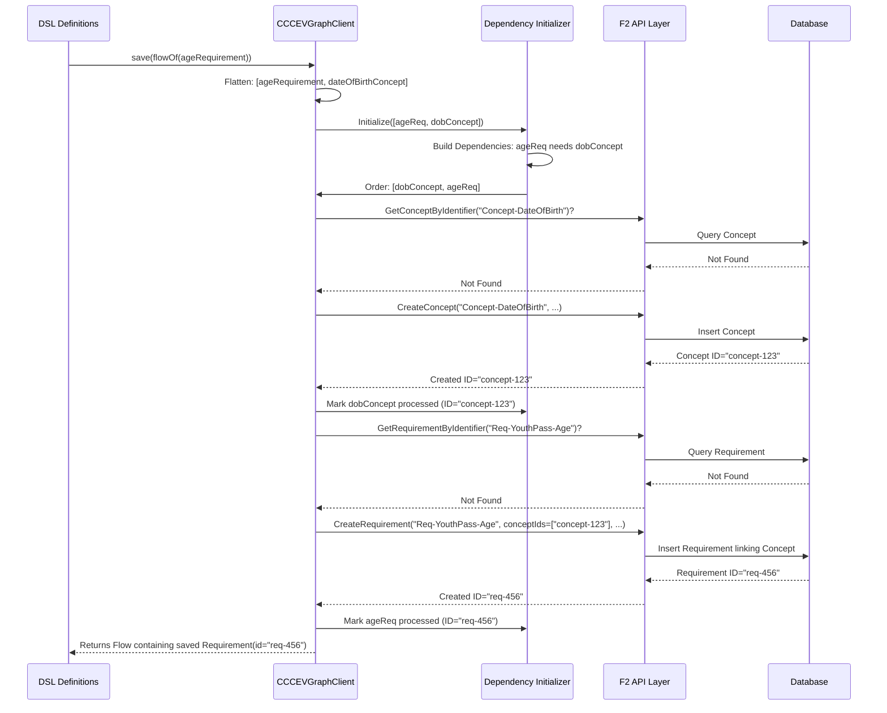

# Chapter 3: CCCEV DSL & Graph Client

In [Chapter 2: Certification Process & Entities](02_certification_process___entities_.md), we saw how `trace-cccev` tracks the status of requirements for a specific application (like John Doe's Youth Pass). But where do those base Requirements (like "Under 26") and InformationConcepts (like "Date of Birth") come from in the first place? Especially when you have many interconnected rules?

Imagine you're setting up a brand new certification system. You need to define *all* the rules, the information needed for each rule, how they relate to each other (maybe one rule depends on another), and the types of proof allowed. Doing this one by one through basic API calls would be like assembling a huge LEGO model by ordering each tiny brick individually – very slow and easy to mess up!

This chapter introduces two powerful tools that make this process much easier: the **CCCEV DSL** and the **CCCEV Graph Client**.

## The Problem: Defining Complex Structures is Hard

Let's think about our Youth Pass example again. We have:
*   An `InformationConcept` for "Date of Birth".
*   A `Requirement` for "Applicant must be under 26", which *needs* the "Date of Birth" concept.

Now, imagine a more complex scenario:
*   A main requirement: "Qualifies for Premium Youth Pass".
*   This main requirement has *sub-requirements*:
    *   "Applicant must be under 26" (needs "Date of Birth").
    *   "Applicant must reside in eligible country" (needs "Country of Residence").
    *   "Applicant must have student status" (needs "Proof of Enrollment").
*   The "Proof of Enrollment" might be defined as an `EvidenceTypeList` allowing specific document types.
*   The "Country of Residence" `InformationConcept` might itself depend on another concept like "Postal Code".

Defining all these pieces and their connections correctly using basic commands can become a tangled web. We need a better way to describe these structures in our code.

## Solution Part 1: The CCCEV DSL - A Specialized Toolkit

The **CCCEV Domain Specific Language (DSL)** provides a Kotlin-native way to define these complex CCCEV structures. Think of it like a specialized toolkit or a recipe format designed specifically for building CCCEV models. Instead of generic Kotlin code, you use special functions (builders) that clearly express "I'm creating a Requirement" or "This Requirement needs this InformationConcept".

**What is a DSL?**
A Domain Specific Language (DSL) is like a mini-language within a regular programming language (like Kotlin). It uses the host language's syntax but provides functions and structures tailored to a specific task (the "domain" - in our case, CCCEV). This makes the code more readable and focused on the *what* (defining a requirement) rather than the *how* (manually setting up objects and links).

**Example: Defining "Date of Birth" with the DSL**

Instead of manually creating an `InformationConcept` object, we can use the `informationConcept` builder function:

```kotlin
// Import necessary builders and models
import cccev.dsl.model.builder.informationConcept
import cccev.dsl.model.XSDDate // Predefined DataUnit for Dates

// Define the "Date of Birth" InformationConcept
val dateOfBirthConcept = informationConcept {
    identifier = "Concept-DateOfBirth" // Unique text ID
    name = "Date of Birth"
    description = "The applicant's date of birth."
    unit = XSDDate // Specify the data type is Date
}
```
*   **(Code Reference:** `cccev-dsl/cccev-dsl-model/src/commonMain/kotlin/cccev/dsl/model/builder/InformationConceptBuilder.kt`)*

This code uses the `informationConcept { ... }` block provided by the DSL. Inside the block, we set properties like `identifier`, `name`, and crucially, the `unit` (data type) in a clear, structured way. It reads almost like a configuration file.

**Example: Defining the "Under 26" Requirement with the DSL**

Now let's define the Requirement that uses this concept:

```kotlin
// Import necessary builders and models
import cccev.dsl.model.builder.informationRequirement
import cccev.dsl.model.RequirementId
import com.benasher44.uuid.uuid4

// Define the "Under 26" InformationRequirement
val ageRequirement = informationRequirement {
    identifier = "Req-YouthPass-Age" // Unique text ID
    name = "Age Requirement for Youth Pass"
    description = "Applicant must be under 26 years old."
    required = true // This requirement is mandatory

    // Link the InformationConcept defined above
    hasConcept {
        +dateOfBirthConcept // Use '+' to add the concept
    }
}
```
*   **(Code Reference:** `cccev-dsl/cccev-dsl-model/src/commonMain/kotlin/cccev/dsl/model/builder/RequirementBuilder.kt` and `Requirement.kt`)*

Again, we use a DSL builder (`informationRequirement { ... }`). Notice the `hasConcept { ... }` block inside – this is the DSL's way of saying "this requirement needs the following concepts". We simply add our previously defined `dateOfBirthConcept` using the `+` operator.

The DSL makes defining nested requirements, linking concepts, specifying evidence types, and setting conditions much more intuitive than manual object creation.

## Solution Part 2: The CCCEV Graph Client - The Smart Saver

Okay, we've used the DSL to define our `Requirement` and `InformationConcept` objects in our Kotlin code. Now, how do we get them *into* the `trace-cccev` system (saved in the database)?

We could manually call the API functions ([Chapter 4: F2 API Layer (Functions, Commands, Queries)](04_f2_api_layer__functions__commands__queries__.md)) to create them. But wait! The `ageRequirement` *depends on* `dateOfBirthConcept`. We *must* create the concept first, get its system ID, and then use that ID when creating the requirement. If we have dozens of interconnected items, figuring out this correct saving order (the "dependency graph") is complicated.

This is where the `CCCEVGraphClient` comes in.

**What it Does:**
The `CCCEVGraphClient` is a smart client that:
1.  Takes a collection of DSL-defined CCCEV objects (like our `ageRequirement` and `dateOfBirthConcept`).
2.  Analyzes the dependencies between them (e.g., Requirements needing Concepts, Requirements having sub-Requirements).
3.  Figures out the correct order to save them to the backend.
4.  Calls the necessary backend APIs ([Chapter 4: F2 API Layer (Functions, Commands, Queries)](04_f2_api_layer__functions__commands__queries__.md)) to create or update the items.
5.  Handles fetching existing items if they already exist based on their `identifier`.

**Analogy:** Think of the `CCCEVGraphClient` as an intelligent construction manager. You give it the blueprints (your DSL definitions). It reads them, understands that the foundation ("Date of Birth" concept) must be laid before the walls ("Under 26" requirement) can be built, and then directs the workers (API calls) in the correct sequence.

**Example: Saving our DSL Definitions**

```kotlin
import cccev.dsl.client.CCCEVClient // Main client access
import kotlinx.coroutines.flow.flowOf
import kotlinx.coroutines.flow.toList

// Assume 'cccevClient' is an instance of CCCEVClient connected to your backend
// val cccevClient = CCCEVClient("http://localhost:8080") // Example setup

suspend fun initializeYouthPassRequirements(cccevClient: CCCEVClient) {
    // Our DSL definitions from before
    val dateOfBirthConcept = informationConcept { /* ... */ }
    val ageRequirement = informationRequirement { /* ... hasConcept { +dateOfBirthConcept } ... */ }

    // Use the graphClient part of the main client
    val savedRequirementsFlow = cccevClient.graphClient.save(
        flowOf(ageRequirement) // Pass a Flow containing our top-level requirement(s)
    )

    // The save function returns a Flow of the created/updated requirements
    val savedList = savedRequirementsFlow.toList()
    println("Successfully saved ${savedList.size} requirement(s).")
    // Output (conceptual): Successfully saved 1 requirement(s).
}

```
*   **(Code Reference:** `cccev-dsl/cccev-dsl-client/src/jvmMain/kotlin/cccev/dsl/client/CCCEVGraphClient.kt` and `CCCEVClient.kt`)*

1.  We assume we have a `CCCEVClient` instance connected to our backend. This client provides access to various sub-clients, including the `graphClient`.
2.  We define our `dateOfBirthConcept` and `ageRequirement` using the DSL as before.
3.  We call `cccevClient.graphClient.save()`. We pass it a `Flow` containing our top-level `ageRequirement`. The graph client will automatically discover the nested `dateOfBirthConcept` through the `hasConcept` link.
4.  The `save` function handles everything: checking dependencies, calling APIs in the right order, and creating/updating the items in the backend.
5.  It returns a `Flow` which, when collected, gives us the final state of the requirements as they exist in the backend after saving.

This is incredibly useful for:
*   **Initialization:** Setting up all the base CCCEV structures when deploying a new system.
*   **Migration:** Moving complex CCCEV definitions from one system or format to another.
*   **Bulk Updates:** Defining and applying changes to a large set of related requirements.

## Under the Hood: How the Graph Client Works

What magic happens inside `CCCEVGraphClient.save()`?

1.  **Flatten and Collect:** It takes the input flow of requirements and recursively explores all nested requirements (`hasRequirement`) and linked concepts (`hasConcept`) to build a flat list of all unique `Requirement` and `InformationConcept` nodes involved.
2.  **Build Dependency Graph:** It analyzes these nodes to understand the dependencies. For example, it notes that `Req-YouthPass-Age` needs `Concept-DateOfBirth`.
3.  **Initialization Order:** It uses a helper class (like `DependencyAwareGraphInitializer`) to sort the nodes topologically. This means items with no dependencies come first, followed by items whose dependencies are now met. For our example, the order would be: [`Concept-DateOfBirth`, `Req-YouthPass-Age`].
4.  **Iterate and Save:** It processes the nodes in the determined order:
    *   **Check Existence:** For the current node (e.g., `Concept-DateOfBirth`), it calls a backend query API (like `InformationConceptGetByIdentifierQuery`) using the node's `identifier`.
    *   **Create or Update:**
        *   If the node *doesn't* exist, it calls the corresponding creation API (e.g., `InformationConceptCreateCommand`) with the data from the DSL object.
        *   If the node *does* exist, it might call an update API (e.g., `InformationConceptUpdateCommand`) to ensure its properties match the DSL definition. (It avoids creating duplicates).
    *   **Track IDs:** It stores the resulting backend ID (e.g., the unique ID generated by the database for `Concept-DateOfBirth`).
    *   **Resolve Dependencies:** When it processes a dependent node later (e.g., `Req-YouthPass-Age`), it uses the tracked ID of its dependency (`Concept-DateOfBirth`) when calling the creation/update API (e.g., `RequirementCreateCommand` needs `conceptIds`).

Let's visualize this flow:



**Diving into the Code (Simplified `CCCEVGraphClient` Logic):**

Inside `CCCEVGraphClient.kt`, the `save` method orchestrates this.

First, it collects all unique nodes:
```kotlin
// Simplified from CCCEVGraphClient.kt
suspend fun save(graph: Flow<Requirement>): Flow<Requirement> {
    val requirements = graph.flatCollect() // Recursively find all Requirements

    val requirementNodes = requirements // ... group by identifier ...
    val informationConceptNodes = requirements // ... find all concepts ...

    // ... more setup ...
}

// Helper to flatten the requirement graph
@OptIn(FlowPreview::class)
private suspend fun Flow<Requirement>.flatCollect(): List<Requirement> {
    // ... logic to traverse hasRequirement, isRequirementOf recursively ...
    // ... returns a flat list of all unique Requirement objects ...
}
```
*   The `flatCollect` helper traverses the requirement structure to find all unique Requirements and their associated Concepts.

Then, it uses the `DependencyAwareGraphInitializer` to handle concepts and requirements separately, ensuring dependencies are met before saving an item:

```kotlin
// Simplified from CCCEVGraphClient.kt & DependencyAwareGraphInitializer.kt
    // ... inside save method ...
    val context = Context() // Holds processed IDs

    // Initialize concepts first (they are often dependencies for requirements)
    informationConceptGraphInitializer.initialize(informationConceptNodes.values) { concept, resolvedDeps ->
        // This block is called ONLY when dependencies are ready
        concept.save(context) // Call API to save/update this concept
    }
    context.processedConcepts.putAllNew(/* ... results ... */)

    // Then initialize requirements
    requirementGraphInitializer.initialize(requirementNodes.values) { requirement, resolvedDeps ->
        // This block is called ONLY when dependencies (concepts, sub-reqs) are ready
        requirement.save(context) // Call API to save/update this requirement
            .also { context.resultRequirements.add(it) } // Collect results
            .id
    }
    context.processedRequirements.putAllNew(/* ... results ... */)

    return context.resultRequirements.asFlow() // Return the final saved items
```
*   **(Code Reference:** `cccev-dsl/cccev-dsl-client/src/jvmMain/kotlin/cccev/dsl/client/graph/DependencyAwareGraphInitializer.kt`)*
*   The `initialize` method (from `DependencyAwareGraphInitializer`) intelligently calls the `save` lambda for each item only *after* its declared dependencies have been processed and their IDs are available in the `resolvedDeps` map (or the shared `context`).

Finally, the `save` method for an individual item (like `Requirement.save` or `InformationConceptDTO.save`) handles checking existence and calling the right API command:

```kotlin
// Simplified from CCCEVGraphClient.kt
private suspend fun InformationConceptDTO.save(context: Context): InformationConceptId {
    // 1. Check if it already exists
    val getResult = InformationConceptGetByIdentifierQuery(identifier = identifier)
        .invokeWith(informationConceptClient.conceptGetByIdentifier())
    val existingConcept = getResult.item

    if (existingConcept == null) {
        // 2a. Doesn't exist -> Create it
        return InformationConceptCreateCommand(
            identifier = identifier,
            name = name,
            hasUnit = context.processedUnits[unit.identifier]!!, // Use ID of already processed Unit
            dependsOn = dependsOn?.map { context.processedConcepts[it]!! } // Use IDs of dependent concepts
            // ... other fields ...
        ).invokeWith(informationConceptClient.conceptCreate()).id
    } else {
        // 2b. Exists -> Update it (or just return ID)
        return InformationConceptUpdateCommand(
            id = existingConcept.id, // Use existing ID
            name = name,
            // ... other fields ...
        ).invokeWith(informationConceptClient.conceptUpdate()).id
    }
}
```
*   This shows the core logic: Query first (`GetByIdentifierQuery`), then either Create (`CreateCommand`) or Update (`UpdateCommand`) using the appropriate F2 client functions ([Chapter 4: F2 API Layer (Functions, Commands, Queries)](04_f2_api_layer__functions__commands__queries__.md)). It uses the `context` to get the backend IDs of dependencies that were processed earlier.

## Conclusion

You've learned about two key tools for managing complex CCCEV structures in `trace-cccev`:

*   **CCCEV DSL:** A Kotlin-based Domain Specific Language using builders (`informationRequirement { ... }`, `informationConcept { ... }`) to define Requirements, Concepts, and their relationships in a readable and structured way.
*   **CCCEV Graph Client:** A smart client (`CCCEVGraphClient`) that takes DSL-defined objects, automatically resolves dependencies between them, and handles saving them to the backend system in the correct order using API calls.

Together, they provide a powerful way to initialize, migrate, or manage large sets of interconnected CCCEV definitions without getting lost in the complexity of manual API calls and dependency tracking.

Now that we've seen how the DSL and Graph Client interact with the backend APIs at a high level, let's dive deeper into that communication layer itself.

Next up: [Chapter 4: F2 API Layer (Functions, Commands, Queries)](04_f2_api_layer__functions__commands__queries__.md)

---

Generated by [AI Codebase Knowledge Builder](https://github.com/The-Pocket/Tutorial-Codebase-Knowledge)