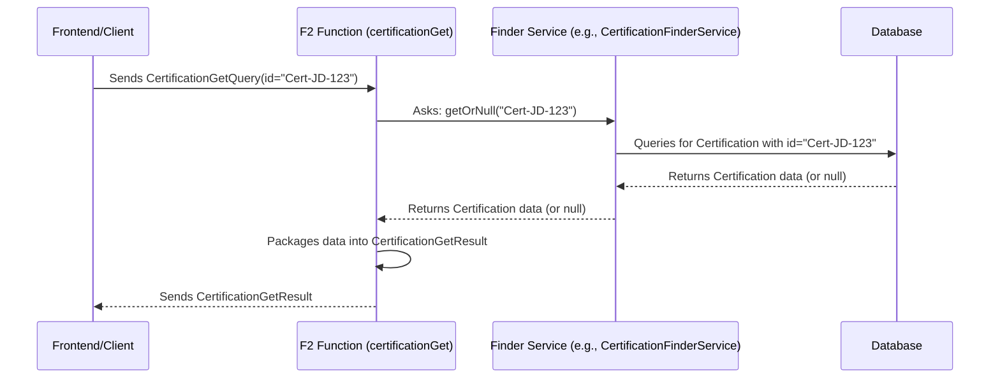
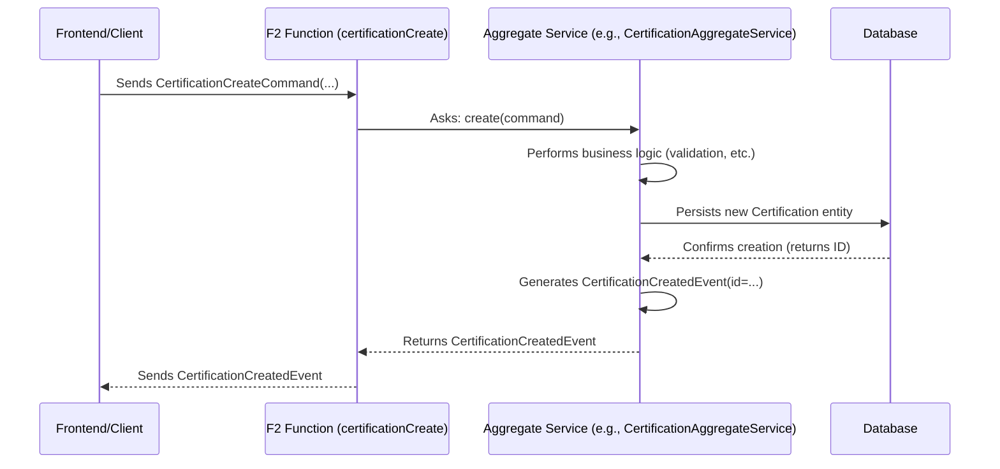

# Chapter 4: F2 API Layer (Functions, Commands, Queries)

In [Chapter 3: CCCEV DSL & Graph Client](03_cccev_dsl___graph_client_.md), we saw how the `CCCEVGraphClient` cleverly saves our complex requirement definitions by talking to the backend. But *how* exactly does it talk to the backend? How does any external system, like a web frontend or another service, interact with the core logic of `trace-cccev`?

Imagine you've built a fantastic website for the Youth Pass application. A user clicks "Apply" or "Check Status". How does that click translate into an action inside our `trace-cccev` backend? This is where the **API Layer** comes in. It's the public face, the communication gateway, for our backend system.

`trace-cccev` uses a specific approach for its API layer based on the **F2 framework** and the **Command-Query Responsibility Segregation (CQRS)** pattern. Let's break down what this means in a very simple way.

## What's the Big Idea? The Restaurant Analogy

Think of the `trace-cccev` backend like a busy restaurant kitchen. It can do many things: prepare food (process data), store ingredients (save data), and check recipes (validate requirements).

*   **The Problem:** How does a customer (like the frontend website or the `CCCEVGraphClient`) interact with the kitchen? They can't just walk in! They need a structured way to place orders or ask questions.
*   **The Solution: The API Layer.** This is like the restaurant's **ordering system** – the menu and the waiter. It provides a defined way for customers to interact with the kitchen without needing to know the kitchen's internal chaos.

In `trace-cccev`, this "ordering system" uses three main concepts: `Queries`, `Commands`, and `Functions`.

## Key Concepts: Asking vs. Doing (CQRS)

The core idea behind CQRS is simple: **separate asking for information from making changes.**

1.  **Queries: Asking for Information**
    *   *Analogy:* Asking the waiter, "What is the soup of the day?" or "Can I see the details of my order #123?". You're just requesting information; you're not changing anything in the kitchen.
    *   *In `trace-cccev`:* A `Query` is an object representing a request to retrieve data. It *doesn't* change the system state.
    *   *Example:* `CertificationGetQuery` – asks for the details of a specific certification (like John Doe's Youth Pass application status).

2.  **Commands: Ordering Changes**
    *   *Analogy:* Telling the waiter, "I'd like to order the soup" or "Please add extra cheese to my order #123". You're asking the kitchen to *do* something, to *change* the state (prepare soup, modify an order).
    *   *In `trace-cccev`:* A `Command` is an object representing a request to change the system state (create, update, delete, add evidence, etc.).
    *   *Example:* `CertificationCreateCommand` – asks the system to create a *new* certification instance.

3.  **F2 Functions: Handling the Requests**
    *   *Analogy:* The waiter who *takes* your query ("What's the soup?") or your command ("Order the soup") and communicates it to the kitchen.
    *   *In `trace-cccev`:* An `F2 Function` is the actual API endpoint. It's a piece of code that listens for incoming `Query` or `Command` objects, understands what needs to be done, interacts with the internal backend logic ([Chapter 5: Aggregate Services (Core Business Logic)](05_aggregate_services__core_business_logic__.md)), and then sends back a result or confirmation.

**Why separate Queries and Commands (CQRS)?**
It often makes the system simpler and more efficient. Reading data (Queries) is usually a very different task than changing data (Commands). Separating them allows optimizing each path independently. For beginners, the main takeaway is that it provides a clear distinction: "Am I just looking, or am I changing something?"

## Using the API: Examples

Let's see how a client (like a frontend or the `CCCEVGraphClient`) would use this API.

**Use Case 1: Asking for Certification Details (Query)**

Imagine the frontend wants to display the status of John Doe's application (ID: "Cert-JD-123").

1.  **The Client Prepares a Query:** It creates a `CertificationGetQuery` object.

    ```kotlin
    // Client code prepares the query object
    val query = CertificationGetQuery(
        id = "Cert-JD-123" // ID of the certification we want
    )
    ```
    *(Simplified representation of `CertificationGetQuery` from `cccev-f2/cccev-f2-domain/.../query/CertificationGetQuery.kt`)*

2.  **The Client Calls the F2 Function:** It sends this `query` object to the `certificationGet` F2 Function endpoint.

    ```kotlin
    // Client code calls the corresponding F2 function
    // (simplified - actual call might use an HTTP client)
    val result: CertificationGetResult = certificationApi.certificationGet()(query)
    ```
    *(Conceptual call to the function defined in `cccev-f2/cccev-f2-domain/src/commonMain/kotlin/cccev/f2/certification/CertificationApi.kt`)*

3.  **The Backend Responds with a Result:** The F2 Function processes the query (we'll see how later) and sends back a `CertificationGetResult` object containing the data.

    ```kotlin
    // Example structure of the result received by the client
    @Serializable // Indicates it can be sent/received over the network
    data class CertificationGetResult(
        // Contains the details of the requested certification (flattened)
        val certification: CertificationFlat?, // Null if not found
        // May include related data (requirements, concepts, etc.)
        val graph: CccevFlatGraph
    )
    ```
    *(Simplified representation of `CertificationGetResult` from `cccev-f2/cccev-f2-domain/.../query/CertificationGetQuery.kt`)*
    The client now has the certification details to display. Nothing changed in the backend.

**Use Case 2: Creating a New Certification (Command)**

Imagine the user clicks "Apply" for a Youth Pass, which requires checking the "Under 26" and "Residency" requirements.

1.  **The Client Prepares a Command:** It creates a `CertificationCreateCommand` object.

    ```kotlin
    // Client code prepares the command object
    val command = CertificationCreateCommand(
        id = "Cert-NewApp-456", // Optional: provide a specific ID
        requirementIdentifiers = listOf(
            "Req-YouthPass-Age",      // Identifier for "Under 26"
            "Req-YouthPass-Residency" // Identifier for "Residency"
        )
    )
    ```
    *(Simplified representation of `CertificationCreateCommand` from `cccev-f2/cccev-f2-domain/.../command/CertificationCreateCommand.kt`)*

2.  **The Client Calls the F2 Function:** It sends this `command` object to the `certificationCreate` F2 Function endpoint.

    ```kotlin
    // Client code calls the corresponding F2 function
    // (simplified)
    val event: CertificationCreatedEvent = certificationApi.certificationCreate()(command)

    ```
    *(Conceptual call to the function defined in `cccev-f2/cccev-f2-domain/src/commonMain/kotlin/cccev/f2/certification/CertificationApi.kt`)*

3.  **The Backend Responds with an Event:** The F2 Function processes the command, *changes* the system state (creates the certification), and sends back a confirmation event, like `CertificationCreatedEvent`.

    ```kotlin
    // Example structure of the event received by the client
    @Serializable
    data class CertificationCreatedEvent(
        // Confirms the ID of the newly created certification
        val id: CertificationId
    )
    ```
    *(Simplified representation of `CertificationCreatedEvent` from `cccev-f2/cccev-f2-domain/.../command/CertificationCreateCommand.kt`)*
    The client now knows the certification was successfully created with the given ID. The backend state has changed.

## What Happens Under the Hood?

Let's peek behind the curtain. How does an F2 Function handle these requests?

**Query Flow (e.g., `certificationGet`)**



1.  The `Client` sends the `CertificationGetQuery` to the `certificationGet` F2 Function.
2.  The `F2 Function` receives the query. Its main job is to delegate. For queries, it usually calls a **Finder Service** (like `CertificationFinderService`).
3.  The `Finder Service` knows how to fetch data from the `Database` ([Chapter 6: Neo4j Graph Persistence (Entities & Repositories)](06_neo4j_graph_persistence__entities___repositories__.md)).
4.  The `Database` returns the data.
5.  The `Finder Service` gives the data back to the `F2 Function`.
6.  The `F2 Function` wraps the data into the expected `CertificationGetResult` format and sends it back to the `Client`.

**Command Flow (e.g., `certificationCreate`)**



1.  The `Client` sends the `CertificationCreateCommand` to the `certificationCreate` F2 Function.
2.  The `F2 Function` receives the command. For commands, it delegates to an **Aggregate Service** ([Chapter 5: Aggregate Services (Core Business Logic)](05_aggregate_services__core_business_logic__.md)). Aggregate Services contain the core business rules for *changing* data.
3.  The `Aggregate Service` (e.g., `CertificationAggregateService`) performs the logic required by the command (e.g., validating input, creating the new `Certification` object).
4.  It instructs the `Database` to save the new data.
5.  Once saved, the `Aggregate Service` might create an **Event** (like `CertificationCreatedEvent`) confirming the change.
6.  This `Event` is returned to the `F2 Function`.
7.  The `F2 Function` sends the `Event` back to the `Client`.

## Diving into the Code (Simplified)

Where are these Commands, Queries, and Functions defined?

**1. Defining the API Interface (`CertificationApi.kt`)**

This file often outlines *what* functions are available for a specific domain (like Certifications).

```kotlin
// Simplified from cccev-f2-domain/.../CertificationApi.kt
package cccev.f2.certification

// Interface combining Query and Command functions for Certifications
interface CertificationApi: CertificationQueryApi, CertificationCommandApi

// Defines the available Query functions
interface CertificationQueryApi {
    fun certificationGet(): CertificationGetFunction // Query function
}

// Defines the available Command functions
interface CertificationCommandApi {
    fun certificationCreate(): CertificationCreateFunction // Command function
    // ... other commands like addRequirements, fillValues, etc.
}
```
*   This acts like a contract, declaring the `certificationGet` (Query) and `certificationCreate` (Command) functions. The actual *types* (`CertificationGetFunction`, `CertificationCreateFunction`) link to the specific input/output types (Query/Result, Command/Event).

**2. Defining the Query and Result (`CertificationGetQuery.kt`)**

```kotlin
package cccev.f2.certification.query

// ... imports ...

// Type alias defining the function signature: Input -> Output
typealias CertificationGetFunction = F2Function<CertificationGetQuery, CertificationGetResult>

// Defines the input data structure for the query
@Serializable
data class CertificationGetQuery(val id: CertificationId): CertificationGetQueryDTO

// Defines the output data structure for the result
@Serializable
data class CertificationGetResult(
    val certification: CertificationFlat?,
    val graph: CccevFlatGraph
): CertificationGetResultDTO

// DTO interfaces for JS compatibility (often match the data class)
interface CertificationGetQueryDTO { val id: CertificationId }
interface CertificationGetResultDTO { /* ... */ }
```
*   This file defines the specific data structures (`CertificationGetQuery` and `CertificationGetResult`) used by the `certificationGet` function. The `typealias` connects them.

**3. Defining the Command and Event (`CertificationCreateCommand.kt`)**

```kotlin
package cccev.f2.certification.command

// ... imports ...

// Type alias defining the function signature: Input -> Output
typealias CertificationCreateFunction = F2Function<CertificationCreateCommand, CertificationCreatedEvent>

// Defines the input data structure for the command
@Serializable
data class CertificationCreateCommand(
    val id: CertificationId?,
    val requirementIdentifiers: List<RequirementIdentifier> = emptyList()
): CertificationCreateCommandDTO

// Defines the output data structure for the event
@Serializable
data class CertificationCreatedEvent(val id: CertificationId): CertificationCreatedEventDTO

// DTO interfaces for JS compatibility
interface CertificationCreateCommandDTO { /* ... */ }
interface CertificationCreatedEventDTO { /* ... */ }
```
*   Similarly, this defines the `CertificationCreateCommand` (input) and `CertificationCreatedEvent` (output) for the `certificationCreate` function.

**4. Implementing the F2 Function Endpoint (`CertificationEndpoint.kt`)**

This is where the API becomes "live". In a Spring Boot application, this often happens in a `@RestController`.

```kotlin
// Simplified from cccev-f2-api/.../CertificationEndpoint.kt
package cccev.f2.certification

// ... imports ...

@RestController // Marks this as a web request handler
@RequestMapping // Base path for requests (optional)
class CertificationEndpoint(
    // Dependencies injected: Services that do the actual work
    private val certificationAggregateService: CertificationAggregateService,
    private val certificationFinderService: CertificationFinderService
): CertificationApi { // Implements the API contract

    // Implementation for the Query function
    @Bean // Makes this function discoverable by the F2 framework
    override fun certificationGet(): CertificationGetFunction = f2Function { query ->
        // 1. Log the incoming query
        logger.info("certificationGet: $query")
        // 2. Delegate to the Finder Service
        val certification = certificationFinderService.getOrNull(query.id)
        // 3. Prepare and return the Result
        CertificationGetResult(certification?.flattenTo(), /*... graph data ...*/)
    }

    // Implementation for the Command function
    @Bean
    override fun certificationCreate(): CertificationCreateFunction = f2Function { command ->
        // 1. Log the incoming command
        logger.info("certificationCreate: $command")
        // 2. Delegate to the Aggregate Service
        certificationAggregateService.create(command)
        // 3. The service returns the Event, which is automatically sent back
    }

    // ... implementations for other functions (addEvidence, fillValues, etc.) ...
}
```
*   `@RestController` makes this class handle web requests.
*   `@Bean` and `f2Function { ... }` wire up the logic for each specific function defined in `CertificationApi`.
*   Inside the lambda (`{ query -> ... }` or `{ command -> ... }`), the code delegates the work:
    *   Queries go to `certificationFinderService`.
    *   Commands go to `certificationAggregateService` ([Chapter 5: Aggregate Services (Core Business Logic)](05_aggregate_services__core_business_logic__.md)).
*   The F2 framework handles the details of receiving HTTP requests, deserializing the JSON payload into the Query/Command objects, calling this lambda, and serializing the Result/Event object back into a JSON response.

You can see similar patterns for other parts of the system, like managing `Requirements` (`RequirementApi`, `RequirementEndpoint`) or `InformationConcepts` (`InformationConceptApi`, `InformationConceptEndpoint`).

## Conclusion

You've now learned about the `trace-cccev` API layer, built using the F2 framework:

*   It acts as the **gateway** for external systems (like frontends) to interact with the backend.
*   It uses **CQRS**: separating `Queries` (asking for data) from `Commands` (requesting changes).
*   **`Queries`** are requests for information (e.g., `CertificationGetQuery`).
*   **`Commands`** are requests to perform actions (e.g., `CertificationCreateCommand`).
*   **`F2 Functions`** are the actual API endpoints that receive Queries/Commands and delegate the work to backend services.
*   This separation makes the interaction clear: Are you reading data or changing it?

These F2 Functions act as the entry point, but the real "thinking" – the business logic for handling commands and validating data – happens in the services they call. Let's explore those next.

Next up: [Chapter 5: Aggregate Services (Core Business Logic)](05_aggregate_services__core_business_logic__.md)

---

Generated by [AI Codebase Knowledge Builder](https://github.com/The-Pocket/Tutorial-Codebase-Knowledge)