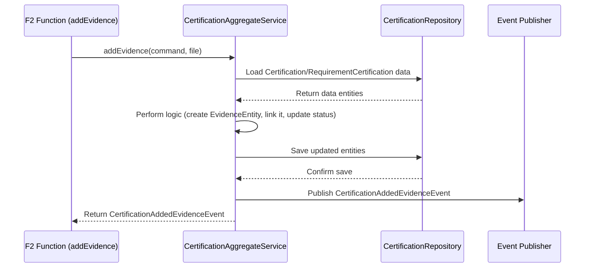

# Chapter 5: Aggregate Services (Core Business Logic)

In [Chapter 4: F2 API Layer (Functions, Commands, Queries)](04_f2_api_layer__functions__commands__queries__.md), we learned how the outside world communicates with `trace-cccev` using `Commands` (to request changes) and `Queries` (to ask for information), handled by `F2 Functions`. We saw that F2 Functions act like waiters, taking orders or questions.

But who actually cooks the food or manages the inventory in our restaurant analogy? The waiter just passes the request along. When a `Command` arrives, like "Create a new Certification" or "Add this piece of evidence", which part of the system *actually* performs the action, makes sure the rules are followed, and updates the data?

That's the job of the **Aggregate Services**. They are the "chefs" or the "kitchen managers" of our backend system.

## The Need: Where the Real Work Happens

Imagine the F2 Function for `CertificationAddEvidenceCommand`. It receives the command with the evidence details and the certification it belongs to. Now what?

*   **Problem:** The F2 Function itself shouldn't contain complex logic. Its job is just to handle the communication (API request/response). We need a dedicated place for the core business rules and actions.
*   **Solution:** **Aggregate Services**. These services contain the specific step-by-step instructions (the business logic) for handling commands related to a particular "aggregate" or domain concept. An "aggregate" here is just a fancy term for a cluster of related objects managed together, like a `Certification` and all its `RequirementCertification`s and `Evidence`.

## Key Concepts: The Domain Managers

1.  **Aggregate Service:** A backend service focused on a specific domain concept (like `Certification` or `Requirement`). It's responsible for:
    *   **Handling Commands:** It takes `Command` objects received from the F2 layer.
    *   **Orchestrating Logic:** It performs the necessary steps to fulfill the command. This might involve validating data, applying business rules, interacting with other services, or creating/updating data entities.
    *   **Using Repositories:** It communicates with the persistence layer ([Chapter 6: Neo4j Graph Persistence (Entities & Repositories)](06_neo4j_graph_persistence__entities___repositories__.md)) to load existing data (like fetching a `Certification` by its ID) and save changes (like saving the updated `Certification` with new evidence).
    *   **Publishing Events:** After successfully processing a command and changing the state, it often publishes an `Event` (like `CertificationAddedEvidenceEvent`) to notify other parts of the system that something happened.

*   *Analogy:* The `CertificationAggregateService` is like the "Certification Manager". If you send a command "Add Evidence to Certification X", the F2 Function (waiter) gives this command to the Certification Manager. The manager fetches Certification X's file (using a repository), checks if the evidence is valid according to the rules, attaches the evidence to the file, saves the updated file (using the repository), and then might announce "Evidence added to Certification X!" (publishes an event).

## Use Case: Adding Evidence to a Certification

Let's follow the journey of an `CertificationAddEvidenceCommand`:

1.  **Client** (e.g., a web frontend) sends the command (containing evidence details, file, target Certification ID) to the corresponding F2 Function. (Covered in [Chapter 4: F2 API Layer (Functions, Commands, Queries)](04_f2_api_layer__functions__commands__queries__.md)).
2.  The **F2 Function** receives the command. It doesn't do much thinking itself.
3.  It calls the appropriate method on the **`CertificationAggregateService`**, passing the command details.
4.  The **`CertificationAggregateService`** now takes over:
    *   It might first validate the command input (e.g., is the Certification ID valid?).
    *   It uses the `CertificationRepository` to load the specific `CertificationEntity` and `RequirementCertificationEntity` from the database.
    *   It performs the core logic: creating an `EvidenceEntity`, linking it to the `RequirementCertificationEntity`. This might involve helper services like `CertificationEvidenceService`.
    *   It might recalculate the status (`isFulfilled`, `isValidated`) of the `RequirementCertificationEntity` based on the new evidence.
    *   It uses the `CertificationRepository` again to save the updated entities back to the database.
    *   It creates and publishes a `CertificationAddedEvidenceEvent`.
5.  The **Aggregate Service** returns the `Event` to the F2 Function.
6.  The **F2 Function** sends the `Event` back to the Client as confirmation.

## What Happens Under the Hood?

Here's a simplified view of the interaction when adding evidence:



1.  The F2 Function calls the `addEvidence` method on the `CertificationAggregateService`.
2.  The Aggregate Service uses the `CertificationRepository` to get the necessary data from the database.
3.  It executes the core business logic (the "how-to" for adding evidence).
4.  It tells the `CertificationRepository` to save the changes.
5.  It notifies the rest of the system by publishing an event via the `Event Publisher`.
6.  It returns the success event back to the F2 Function.

## Diving into the Code (Simplified)

Let's look at a simplified version of `CertificationAggregateService.kt`.

**The Service Class Definition:**

```kotlin
// Simplified from cccev-core/.../CertificationAggregateService.kt
package cccev.core.certification

// ... imports for commands, events, entities, repositories ...
import cccev.core.certification.entity.CertificationRepository // To load/save
import org.springframework.context.ApplicationEventPublisher    // To publish events
import org.springframework.stereotype.Service                     // Marks as a service

@Service // Tells the framework this is a manageable service component
class CertificationAggregateService(
    // Dependencies needed by the service are injected here
    private val applicationEventPublisher: ApplicationEventPublisher,
    private val certificationRepository: CertificationRepository,
    // Maybe other services it collaborates with:
    private val certificationEvidenceService: CertificationEvidenceService,
    // ... potentially file client, other repositories ...
) {
    // Methods for handling commands will go here...
}
```
*   This sets up the `CertificationAggregateService` class.
*   `@Service` makes it recognizable to the Spring framework.
*   The `constructor` (the part in parentheses) declares the dependencies it needs: the `ApplicationEventPublisher` to send events and the `CertificationRepository` to interact with the database for Certifications. These are automatically provided by the framework (dependency injection).

**Example: The `addEvidence` Method (Simplified):**

```kotlin
// Inside CertificationAggregateService class

suspend fun addEvidence(
    command: CertificationAddEvidenceCommand,
    file: ByteArray, // The actual file content
    filename: String? // Original filename
): CertificationAddedEvidenceEvent {

    // 1. Delegate core evidence creation/linking logic
    // (May happen in a helper service)
    val evidenceId = certificationEvidenceService.addEvidence(
        command = command // Pass command details
        /* ... path details ... */
    )

    // 2. (Potentially) Upload the file to storage
    // fileClient.fileUpload(...)

    // 3. Create the success event
    val event = CertificationAddedEvidenceEvent(
        id = command.id, // Certification ID
        evidenceId = evidenceId, // ID of the new evidence
        // ... other details like file path ...
    )

    // 4. Publish the event
    applicationEventPublisher.publishEvent(event)

    // 5. Return the event
    return event
}
```
*   This simplified `addEvidence` method handles the `CertificationAddEvidenceCommand`.
*   **(Step 1):** It might delegate the detailed work of creating the `EvidenceEntity` and linking it correctly to another specialized service (`certificationEvidenceService`). This keeps the aggregate service focused on orchestration. The helper service would likely use the `CertificationRepository` to load/save data.
*   **(Step 2):** It might interact with a file storage client to save the actual evidence file.
*   **(Step 3):** It creates the `CertificationAddedEvidenceEvent` containing relevant IDs.
*   **(Step 4):** It uses the injected `applicationEventPublisher` to notify the system about the successful addition.
*   **(Step 5):** It returns the event, which eventually goes back to the original caller via the F2 Function.

*(Note: The actual implementation in `CertificationAggregateService.kt` might load entities directly and perform more logic within the `addEvidence` method itself, or structure the delegation differently. This simplified version emphasizes the core responsibilities.)*

You'll find similar Aggregate Services for other core concepts:
*   `InformationConceptAggregateService`: Handles creating/updating `InformationConcepts`.
*   `RequirementAggregateService`: Handles creating/updating `Requirements`, adding sub-requirements, linking concepts, etc.
*   `EvidenceTypeAggregateService`: Handles creating `EvidenceTypes`.
*   `DataUnitAggregateService`: Handles creating/updating `DataUnits`.

*(Code References: Located in `cccev-core/src/jvmMain/kotlin/cccev/core/...` sub-packages like `certification`, `concept`, `requirement`, etc.)*

These services encapsulate the "how-to" for modifying each part of the domain model, ensuring business rules are followed and data consistency is maintained via repositories.

## Conclusion

You've now seen where the core business logic of `trace-cccev` resides:

*   **Aggregate Services** (like `CertificationAggregateService`) are the "brains" or "managers" for specific domain areas.
*   They receive **Commands** from the [Chapter 4: F2 API Layer (Functions, Commands, Queries)](04_f2_api_layer__functions__commands__queries__.md).
*   They **orchestrate** the steps needed to fulfill the command, applying business rules.
*   They use **Repositories** to load and save data from the persistence layer.
*   They publish **Events** to announce successful changes.

These services are central to the application's functionality, acting as the bridge between the API requests and the underlying data storage. Speaking of data storage, let's now explore how these entities are actually saved and retrieved.

Next up: [Chapter 6: Neo4j Graph Persistence (Entities & Repositories)](06_neo4j_graph_persistence__entities___repositories__.md)

---

Generated by [AI Codebase Knowledge Builder](https://github.com/The-Pocket/Tutorial-Codebase-Knowledge)