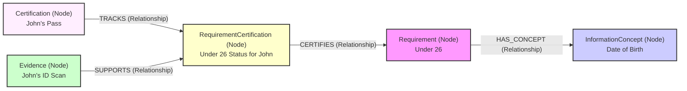
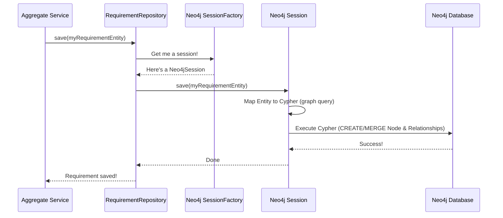

# Chapter 6: Neo4j Graph Persistence (Entities & Repositories)

Welcome to the final chapter! In [Chapter 5: Aggregate Services (Core Business Logic)](05_aggregate_services__core_business_logic__.md), we saw how Aggregate Services like `CertificationAggregateService` handle commands and orchestrate the main business logic. For example, when you add evidence, the service processes it. But after all that work, where does the data actually *go*? How is John Doe's Youth Pass application, with all its requirements and evidence, remembered by the system so he can check its status later?

This is where **persistence** comes in – saving data so it lasts, even if the application restarts. `trace-cccev` uses a special kind of database called **Neo4j**, which is a graph database, to store its information. This chapter will explain what that means and how it works.

## The Problem: Saving Our Interconnected Information

Think about the data in `trace-cccev`:
*   A `Requirement` ("Under 26") *needs* an `InformationConcept` ("Date of Birth").
*   A `Certification` (John Doe's application) *tracks* multiple `RequirementCertification`s (status of "Under 26" for John).
*   `Evidence` (ID Scan) *supports* a `RequirementCertification`.

All these pieces are connected. A simple table-based database (like rows and columns in a spreadsheet) can store this, but it gets complicated to show all the links.

**Analogy:** Imagine you have a big corkboard.
*   You pin up a note for "Requirement: Under 26".
*   You pin up another note for "Concept: Date of Birth".
*   You then draw a line or use a string to connect these two notes, showing "Under 26" *needs* "Date of Birth".

This is exactly what a graph database like Neo4j helps us do, but digitally!

## Key Concepts: Our Digital Corkboard

### 1. Neo4j: The Graph Database

Instead of tables, Neo4j stores data as:
*   **Nodes:** These are like the individual notes on our corkboard. Each piece of data (a specific Requirement, a specific InformationConcept, John Doe's Certification) is a node.
*   **Relationships:** These are like the strings or lines connecting our notes. They show how different nodes are related to each other (e.g., this Requirement *HAS_CONCEPT* that InformationConcept).

This structure is great for `trace-cccev` because our data is all about these connections!


This diagram shows how different pieces of information are nodes, and the connections between them are relationships.

### 2. Entities: The "Notes" (Nodes) in Code

In our Kotlin code, these "notes" or nodes are represented by classes called **Entities**. For example, we have:
*   `RequirementEntity`: Represents a Requirement node.
*   `InformationConceptEntity`: Represents an InformationConcept node.
*   `CertificationEntity`: Represents a Certification node.

These Kotlin classes are marked with special annotations (like labels on our notes) that tell Neo4j how to store them.

```kotlin
// Simplified from cccev-core/.../RequirementEntity.kt
import org.neo4j.ogm.annotation.Id
import org.neo4j.ogm.annotation.NodeEntity

@NodeEntity("Requirement") // Tells Neo4j this is a "Requirement" node
class RequirementEntity {
    @Id // Marks this field as the unique ID for the node
    lateinit var id: String
    lateinit var identifier: String // e.g., "Req-YouthPass-Age"
    var name: String? = null
    // ... other properties ...
}
```
*   `@NodeEntity("Requirement")`: This annotation tells the system that objects of `RequirementEntity` should be stored as nodes with the label "Requirement" in Neo4j.
*   `@Id`: This annotation marks the `id` field as the unique identifier for this node in the database.

### 3. Relationships: The "Strings" (Connections) in Code

To define the "strings" connecting our nodes, Entities use the `@Relationship` annotation.

```kotlin
// Simplified from cccev-core/.../RequirementEntity.kt
import org.neo4j.ogm.annotation.Relationship

@NodeEntity("Requirement")
class RequirementEntity {
    @Id lateinit var id: String
    // ... other properties ...

    // This Requirement can have many InformationConcepts
    @Relationship("HAS_CONCEPT") // Defines the type of relationship
    var concepts: MutableList<InformationConceptEntity> = mutableListOf()
}
```
*   `@Relationship("HAS_CONCEPT")`: This annotation on the `concepts` field means that a `RequirementEntity` node can be connected to one or more `InformationConceptEntity` nodes using a relationship named "HAS_CONCEPT".

So, if we have `ageRequirementEntity` and `dateOfBirthConceptEntity`, adding `dateOfBirthConceptEntity` to `ageRequirementEntity.concepts` would create a `HAS_CONCEPT` link between their nodes in Neo4j.

### 4. Repositories: The Librarians for Our Data

Okay, we have these Entity classes. But how do we actually save them to Neo4j or get them back? We don't want to write complex database queries all the time.

This is where **Repositories** come in. Think of them as expert librarians:
*   You give them an Entity (a book). They know exactly where and how to store it in the library (Neo4j).
*   You ask them for an Entity by its ID (a book by its title or ISBN). They know how to find it and bring it to you.

In `trace-cccev`, we have repositories like:
*   `RequirementRepository`: Handles saving and loading `RequirementEntity` objects.
*   `CertificationRepository`: Handles `CertificationEntity` objects.

```kotlin
// Simplified from cccev-core/.../RequirementRepository.kt
import org.neo4j.ogm.session.SessionFactory
import org.springframework.stereotype.Service

@Service // Marks this as a service managed by the Spring framework
class RequirementRepository(
    private val sessionFactory: SessionFactory // Tool to talk to Neo4j
) {
    suspend fun findById(id: String): RequirementEntity? {
        // Uses sessionFactory to load a RequirementEntity by its ID
        return sessionFactory.session { session ->
            session.load(RequirementEntity::class.java, id)
        }
    }

    suspend fun save(entity: RequirementEntity) {
        // Uses sessionFactory to save the RequirementEntity
        sessionFactory.session { session ->
            session.save(entity)
        }
    }
}
```
*   `@Service`: Tells the Spring framework to manage this repository.
*   `sessionFactory`: This is an object (provided by `Neo4jConfig.kt` and `Neo4jUtils.kt`) that gives us a `Session` to interact with Neo4j.
*   `findById(id)`: A method to fetch a `RequirementEntity` from Neo4j using its ID.
*   `save(entity)`: A method to store a `RequirementEntity` (and its relationships) into Neo4j.

## Using Entities & Repositories: Saving John's Application

Let's go back to [Chapter 5: Aggregate Services (Core Business Logic)](05_aggregate_services__core_business_logic__.md). Imagine the `CertificationAggregateService` just processed a `CertificationCreateCommand` for John Doe's Youth Pass. It has created a `CertificationEntity` object in memory. Now it needs to save it.

1.  **Aggregate Service has an Entity:** The service has a `certificationEntity` object ready.
    ```kotlin
    // Inside an Aggregate Service (conceptual)
    val newCertification = CertificationEntity().apply {
        id = "Cert-JD-123"
        // ... set other properties and link RequirementCertifications ...
    }
    ```

2.  **Aggregate Service uses Repository to Save:** The service calls the `save` method on its `CertificationRepository`.
    ```kotlin
    // Inside an Aggregate Service, which has 'certificationRepository'
    certificationRepository.save(newCertification)
    // Output: The newCertification data is now stored in Neo4j!
    ```
    The `CertificationRepository` (using the `sessionFactory`) translates this `CertificationEntity` object, including its linked `RequirementCertificationEntity` objects and their relationships, into Neo4j nodes and relationships and saves them.

Later, if John Doe wants to check his application status:

1.  **Aggregate Service needs to Fetch:** A query comes in for "Cert-JD-123". The service needs to get this data.
2.  **Aggregate Service uses Repository to Find:**
    ```kotlin
    // Inside an Aggregate Service
    val certificationId = "Cert-JD-123"
    val johnsCertification: CertificationEntity? =
        certificationRepository.findById(certificationId)
    // Output: johnsCertification now holds the data fetched from Neo4j,
    // or null if not found.
    ```
    The `CertificationRepository` asks Neo4j for the node with ID "Cert-JD-123" and reconstructs it into a `CertificationEntity` object.

## Under the Hood: What Happens When You `save()`?

Let's simplify the journey of `requirementRepository.save(myRequirementEntity)`:



1.  **Aggregate Service** calls `requirementRepository.save(myRequirementEntity)`.
2.  The **Repository** gets a `Neo4jSession` from the `SessionFactory`. This session is like an active connection to the database.
3.  The Repository tells the **Neo4jSession** to `save(myRequirementEntity)`.
4.  The **Neo4jSession** (part of a library called Neo4j-OGM - Object Graph Mapper) looks at `myRequirementEntity`:
    *   It sees the `@NodeEntity` and `@Relationship` annotations.
    *   It translates the Kotlin object and its connections into Neo4j's query language (Cypher). For a new entity, this would be like `CREATE (r:Requirement {id: '...', name: '...'}) ...`.
5.  The **Neo4jSession** sends this Cypher query to the **Neo4j Database**.
6.  The **Neo4j Database** creates or updates the node and its relationships.
7.  Confirmation flows back.

**Code Dive (Simplified Repository Methods):**

Repositories use the `SessionFactory` (from `cccev-infra/neo4j/src/main/kotlin/cccev/infra/neo4j/Neo4jConfig.kt` and `Neo4jUtils.kt`) to interact with Neo4j.

```kotlin
// In cccev-core/.../CertificationRepository.kt
// (Simplified for clarity)

suspend fun findById(id: CertificationId): CertificationEntity? =
    sessionFactory.session { session -> // Get a Neo4j session
        // Load an entity of type CertificationEntity with the given id.
        // The '0' means only load the direct entity, not too many related items.
        session.load(CertificationEntity::class.java, id, 0)
    }

suspend fun save(entity: CertificationEntity, depth: Int = -1) =
    sessionFactory.session { session -> // Get a Neo4j session
        // Save the entity. 'depth = -1' usually means save the entity
        // and all related entities it references that are also modified.
        session.save(entity, depth)
    }
```
*   `session.load(...)`: This is a Neo4j-OGM method that fetches a node by its ID and converts it into the specified Kotlin Entity class.
*   `session.save(...)`: This Neo4j-OGM method takes a Kotlin Entity object, figures out the corresponding graph structure (nodes and relationships), and persists it to Neo4j. If the node already exists, it's updated.

Some repository methods might use custom Cypher queries for more complex lookups, as seen in `CertificationRepository.kt` for methods like `findRequirementCertificationsLinkedToInformationConcept`.

```kotlin
// Example of a more custom query in CertificationRepository.kt
suspend fun findParentsOf(
    requirementCertificationId: RequirementCertificationId
): List<RequirementCertificationEntity> = sessionFactory.session { session ->
    // This is a Cypher query string
    val query = "MATCH (:${RequirementCertificationEntity.LABEL} {id: \$rcId})" +
                "<-[:${RequirementCertificationEntity.IS_CERTIFIED_BY}]-(parent:${RequirementCertificationEntity.LABEL})"
                    .returnWholeEntity("parent") // Helper to fetch full entity
    session.query(
        query,
        mapOf("rcId" to requirementCertificationId) // Parameters for the query
    ).map { it["parent"] as RequirementCertificationEntity } // Convert results
}
```
*   This method uses a specific Cypher query to find parent `RequirementCertificationEntity` nodes.
*   `session.query(...)` executes this custom query.

## Conclusion

You've reached the end of our tutorial journey! In this chapter, you learned how `trace-cccev` makes its data last:

*   It uses **Neo4j**, a graph database, ideal for storing interconnected data like Requirements, Certifications, and their relationships.
*   **Entities** (like `RequirementEntity`, `InformationConceptEntity`) are Kotlin classes annotated with `@NodeEntity` that represent the "notes" (nodes) in our graph.
*   `@Relationship` annotations define the "strings" (relationships) connecting these nodes.
*   **Repositories** (like `RequirementRepository`, `CertificationRepository`) act as "librarians," providing easy methods (`save`, `findById`) for Aggregate Services to store and retrieve these entities without writing raw database queries.
*   Under the hood, a library called Neo4j-OGM (Object Graph Mapper) helps translate between Kotlin objects and the Neo4j graph structure.

By understanding these layers – from the [Core Vocabulary](01_cccev_core_vocabulary__requirement__evidence__informationconcept__.md) and [Certification Process](02_certification_process___entities_.md), through the [DSL & Client](03_cccev_dsl___graph_client_.md) for defining data, the [F2 API Layer](04_f2_api_layer__functions__commands__queries__.md) for communication, the [Aggregate Services](05_aggregate_services__core_business_logic__.md) for business logic, and finally to Neo4j Persistence for storage – you now have a solid overview of how `trace-cccev` works!

We hope this tutorial has been helpful for getting started with `trace-cccev`. Happy coding!

---

Generated by [AI Codebase Knowledge Builder](https://github.com/The-Pocket/Tutorial-Codebase-Knowledge)