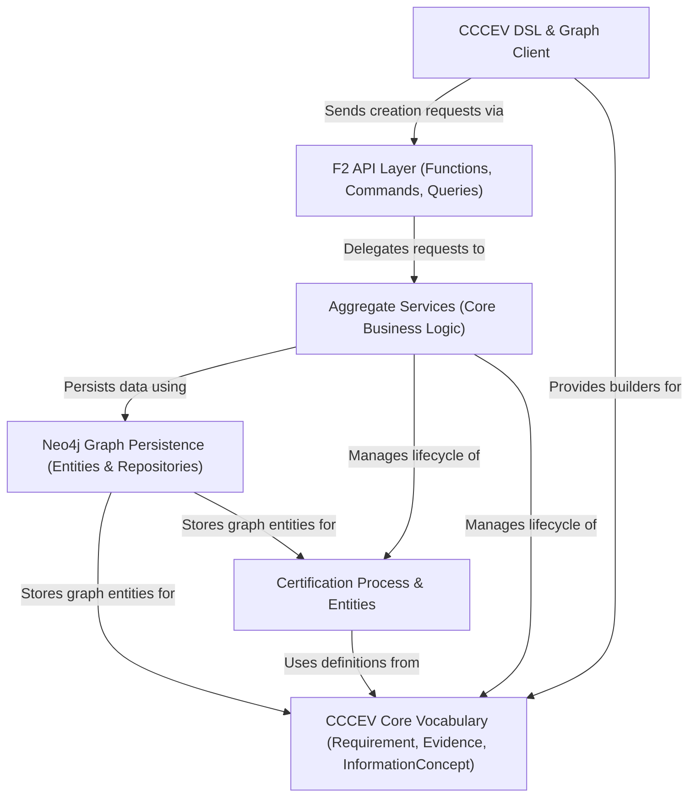

# Tutorial: trace-cccev

The `trace-cccev` project facilitates managing **certification processes**.
It allows defining complex *Requirements* based on the standard CCCEV vocabulary, including associated *InformationConcepts* (specific data points) and needed *Evidence* (proofs).
The system uses a **Neo4j graph database** to store these interconnected elements and provides an **F2 API** to create certifications and track their fulfillment by adding evidence and values.

**Source Repository:** [https://github.com/komune-io/trace-cccev](https://github.com/komune-io/trace-cccev)

## Chapters

1. [CCCEV Core Vocabulary (Requirement, Evidence, InformationConcept)
](01_cccev_core_vocabulary__requirement__evidence__informationconcept__.md)
2. [Certification Process & Entities
](02_certification_process___entities_.md)
3. [CCCEV DSL & Graph Client
](03_cccev_dsl___graph_client_.md)
4. [F2 API Layer (Functions, Commands, Queries)
](04_f2_api_layer__functions__commands__queries__.md)
5. [Aggregate Services (Core Business Logic)
](05_aggregate_services__core_business_logic__.md)
6. [Neo4j Graph Persistence (Entities & Repositories)
](06_neo4j_graph_persistence__entities___repositories__.md)

---

Generated by [AI Codebase Knowledge Builder](https://github.com/The-Pocket/Tutorial-Codebase-Knowledge)