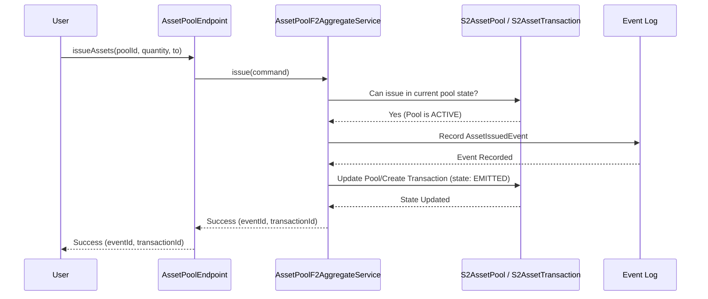

# Chapter 1: Project & Asset Management

Welcome to the `trace-registry`! This platform helps manage important environmental projects and the valuable assets they create, like carbon credits. Think of it like a specialized digital notebook for tracking green initiatives.

In this first chapter, we'll explore the core concepts of **Projects** and **Assets**.

## What's the Big Idea?

Imagine you're running a project to plant a forest. This project helps the environment by absorbing carbon dioxide (CO2). For every ton of CO2 your forest captures, you might get a "carbon credit" – a digital certificate you can sell to companies that need to offset their emissions.

Now, how do you keep track of:

1.  Details about your forest project (where it is, how big, etc.)?
2.  How many carbon credits your project has generated?
3.  Who owns which credits?
4.  Whether a credit has been "used up" (retired) to offset emissions?

Doing this manually with spreadsheets can get messy and hard to trust, especially if many people are involved or if you want to trade these credits.

The `trace-registry` solves this by providing a structured way to manage **Projects** and their associated **Assets** (like those carbon credits).

## Key Concepts Explained

Let's break down the main building blocks:

1.  **Project:**
    *   **What it is:** A specific initiative you want to track. This could be your forest planting project, a solar farm installation, or a program distributing clean cookstoves.
    *   **Think of it like:** A dedicated folder or binder for everything related to one specific initiative.
    *   **What it stores:** Information like the project's name, location, type (e.g., Forestry, Renewable Energy), start date, who is running it, and potentially links to documents or certifications.

2.  **Asset:**
    *   **What it is:** A valuable, traceable item generated by or associated with a Project. Carbon credits are a common example, but assets could also represent Renewable Energy Certificates (RECs), plastic removal credits, or other environmental units.
    *   **Think of it like:** A specific, valuable item produced by the project, like a numbered certificate or a unique digital token. Each asset has details like its origin (which project made it), who currently owns it, its quantity (e.g., 1 ton of CO2 equivalent), and its current status.

3.  **Asset Pool:**
    *   **What it is:** A grouping of similar Assets, often from the same Project and sharing key characteristics (like the year they were generated, often called the "vintage").
    *   **Think of it like:** A storage container (like a silo on a farm) holding many identical items (like bags of grain from the 2024 harvest). It makes managing large quantities of similar assets much easier. For example, you might have an "EcoForest Project - 2024 Carbon Credits" pool.
    *   **Why use it:** Simplifies tracking and trading. Instead of dealing with thousands of individual credit records, you can manage them as part of a pool.

4.  **Asset Lifecycle:**
    *   **What it is:** The journey an Asset takes from creation to final use.
    *   **Think of it like:** The life story of a concert ticket: Printed (Issued) -> Sold to you (Transferred) -> Used to enter the concert (Retired).
    *   **Key Stages:**
        *   **Issuance:** The asset is officially created and recorded in the registry, linked to its project and pool. (Your forest project generated 100 credits).
        *   **Transfer:** Ownership of the asset changes from one party to another. (You sell 10 credits to Company B).
        *   **Retirement/Offsetting:** The asset is permanently "used up" to claim its environmental benefit. It cannot be transferred again. (Company B uses 5 credits to offset its emissions).

    Here's a simple view of the lifecycle:

    ```mermaid
    graph LR
        A[Issuance (Created)] --> B(Available);
        B --> C{Transfer?};
        C -- Yes --> B;
        C -- No ---> D{Retire/Offset?};
        D -- Yes --> E[Retired (Used)];
        D -- No ---> B;

    ```

## How to Use It: A Simple Walkthrough

Let's see how you'd interact with the system for our forest project example. We'll use conceptual examples – the actual code involves specific function calls you'll learn more about in [Chapter 4: F2 Function-Based APIs](04_f2_function_based_apis_.md).

1.  **Create the Project:**
    *   You tell the system about your "EcoForest Planting Initiative".

    ```kotlin
    // Simplified concept
    createProject(
        name = "EcoForest Planting Initiative",
        location = "Green Valley",
        type = "Forestry",
        // ... other details
    )
    // Result: The project is now registered with a unique ID.
    ```
    *   This uses functionality likely found in `ProjectEndpoint.kt`.

2.  **Create an Asset Pool:**
    *   You create a pool specifically for the carbon credits generated this year.

    ```kotlin
    // Simplified concept
    createAssetPool(
        projectId = "project-ecoforest-id", // ID from step 1
        vintage = "2024", // Year the credits relate to
        indicator = "tCO2e", // Unit: tonnes of CO2 equivalent
        // ... other details like granularity
    )
    // Result: An asset pool is created, linked to your project.
    ```
    *   This uses functionality likely found in `AssetPoolEndpoint.kt`.

3.  **Issue Assets:**
    *   An independent verifier confirms your forest captured 100 tons of CO2. You issue 100 credits into the pool.

    ```kotlin
    // Simplified concept
    issueAssets(
        poolId = "pool-ecoforest-2024-id", // ID from step 2
        quantity = 100.0,
        to = "Your Organization ID" // Initial owner
    )
    // Result: 100 assets (credits) are created in the pool, owned by you.
    ```
    *   This uses functionality likely found in `AssetPoolEndpoint.kt`.

4.  **Transfer Assets:**
    *   You sell 20 credits to "CarbonOffset Corp".

    ```kotlin
    // Simplified concept
    transferAssets(
        poolId = "pool-ecoforest-2024-id",
        quantity = 20.0,
        from = "Your Organization ID",
        to = "CarbonOffset Corp ID"
    )
    // Result: Ownership of 20 credits moves to CarbonOffset Corp.
    ```
    *   This also uses functionality from `AssetPoolEndpoint.kt`.

5.  **Retire Assets:**
    *   "CarbonOffset Corp" uses 5 of its credits to offset its emissions.

    ```kotlin
    // Simplified concept
    retireAssets(
        poolId = "pool-ecoforest-2024-id",
        quantity = 5.0,
        from = "CarbonOffset Corp ID" // The owner retiring them
    )
    // Result: 5 credits are marked as "Retired" and cannot be used again.
    ```
    *   Again, this uses functionality from `AssetPoolEndpoint.kt`.

6.  **Place Orders (Optional):**
    *   You might want to place a "sell order" for your remaining credits, or someone might place a "buy order". The system can manage these orders.

    ```kotlin
    // Simplified concept
    placeOrder(
        poolId = "pool-ecoforest-2024-id",
        quantity = 50.0,
        type = "SELL", // or "BUY"
        pricePerUnit = 15.00 // Optional
    )
    // Result: An order is created, waiting to be matched or fulfilled.
    ```
    *   This uses functionality from `AssetEndpoint.kt`.

## Under the Hood: How Does It Work?

When you perform an action like "issuing an asset", several things happen behind the scenes. The system uses concepts you'll learn more about later, like [F2 Function-Based APIs](04_f2_function_based_apis_.md) for handling requests and [S2 Event Sourcing & State Management](05_s2_event_sourcing___state_management_.md) for reliably tracking changes.

Let's trace the "Issue Assets" example:

1.  **Your Request:** You send the `issueAssets` command via an API call.
2.  **API Endpoint:** The `AssetPoolEndpoint.kt` receives your request. It checks if you have permission (`AssetPoolPoliciesEnforcer`).
3.  **Business Logic:** It calls a service (`AssetPoolF2AggregateService`) that understands the rules of issuing assets.
4.  **State Machine:** This service uses a predefined process model (a "state machine," defined in `S2AssetPool.kt`) to ensure issuing is allowed. For example, assets can only be issued into an `ACTIVE` pool, not a `CLOSED` one.
5.  **Event Recording:** If everything is valid, the system records an "AssetIssued" event. This event is the permanent record of what happened.
6.  **State Update:** Based on the event, the system updates the current state of the asset pool (e.g., increases the available quantity). A separate record for the specific transaction (issuance) is also created, managed by `S2AssetTransaction.kt`.
7.  **Response:** The system confirms back to you that the assets were issued, often providing the ID of the transaction.

Here's a simplified sequence diagram:



**Code Glimpse:**

*   In `AssetPoolEndpoint.kt`, the function to handle issuing looks something like this:

    ```kotlin
    // From: platform/project/f2/asset-pool-f2/asset-pool-f2-api/src/main/kotlin/io/komune/registry/f2/asset/pool/api/AssetPoolEndpoint.kt

    @Bean
    override fun assetIssue(): AssetIssueFunction = f2Function { command ->
        logger.info("assetIssue: $command") // Log the request
        assetPoolPoliciesEnforcer.checkIssue() // Check permissions
        // Call the service to handle the core logic
        assetPoolF2AggregateService.issue(command)
            .let { /* Format the successful result */ }
    }
    ```
    This code sets up a function (`assetIssue`) that gets triggered by an API request. It first logs the request, checks permissions, and then passes the command to the `assetPoolF2AggregateService` to do the actual work.

*   The state of an Asset Pool is managed by a state machine defined in `S2AssetPool.kt`:

    ```kotlin
    // From: platform/project/s2/asset/asset-domain/src/commonMain/kotlin/io/komune/registry/s2/asset/domain/automate/S2AssetPool.kt

    @Serializable
    enum class AssetPoolState(override val position: Int): S2State {
        ACTIVE(0), // Can issue, transfer, retire
        ON_HOLD(1), // Temporarily suspended
        CLOSED(2) // Permanently closed
    }

    // Defines rules like: emitting transactions (issuing, etc.) is allowed in ACTIVE state
    selfTransaction<AssetPoolEmitTransactionCommand, AssetPoolEmittedTransactionEvent> {
        states += AssetPoolState.ACTIVE
        role = AssetPoolRole.Issuer
    }
    ```
    This defines the possible states (`ACTIVE`, `ON_HOLD`, `CLOSED`) and specifies which actions (like `AssetPoolEmitTransactionCommand`) are allowed in which state.

Similarly, Projects (`S2Project.kt`), individual Transactions (`S2AssetTransaction.kt`), and Orders (`S2Order.kt`) also have their own states and lifecycles managed by corresponding state machines. This ensures that actions happen in the correct order and maintain the integrity of the registry.

## Conclusion

You've now learned the basics of Project and Asset management in `trace-registry`:

*   **Projects** represent real-world initiatives.
*   **Assets** are the valuable, trackable units (like carbon credits) linked to projects.
*   **Asset Pools** help group and manage similar assets.
*   Assets have a defined **Lifecycle** (Issued -> Transferred -> Retired).
*   The system provides functions to manage these entities and uses state machines and event sourcing internally for reliability.

This foundation is crucial for understanding how `trace-registry` works. Now that we know *how* to manage projects and assets, how do we describe them in a standardized way so others can easily discover and understand them? That's where cataloguing comes in.

Let's move on to the next chapter: [Chapter 2: Catalogue & Dataset Management (DCAT/DCAT-AP)](02_catalogue___dataset_management__dcat_dcat_ap__.md) to learn how we make project and asset information discoverable.

---

Generated by [AI Codebase Knowledge Builder](https://github.com/The-Pocket/Tutorial-Codebase-Knowledge)