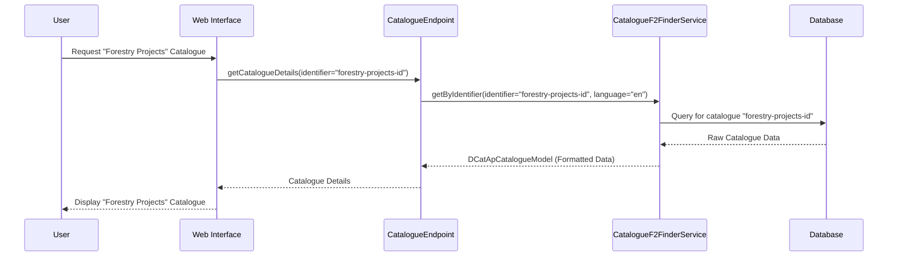

# Chapter 2: Catalogue & Dataset Management (DCAT/DCAT-AP)

In [Chapter 1: Project & Asset Management](01_project___asset_management_.md), we learned how `trace-registry` helps us create and track environmental projects (like our "EcoForest Planting Initiative") and the valuable assets they produce (like carbon credits). We saw how to issue, transfer, and retire these assets.

But how do we tell the world about these projects and assets? If we have many projects, how can someone find a specific one, or all projects related to forestry, for example? This is where **Catalogue and Dataset Management** comes in.

## What's the Big Idea? Organizing Our Digital Library

Imagine `trace-registry` as a sophisticated digital library.
*   In Chapter 1, we essentially "wrote the books" (created Projects and Assets).
*   Now, in Chapter 2, we need to organize these books on shelves and create library cards for them so people can easily find and understand what's available.

This system uses:
*   **"Catalogues"** which are like the main sections or bookshelves in our library (e.g., 'Renewable Energy Projects', 'Forestry Standards').
*   **"Datasets"** which are like the individual books or specific collections of information on those shelves (e.g., the detailed description of our "EcoForest Planting Initiative" project, or a specific forestry standard document).

To make sure everyone describes these "books" (Datasets) and "shelves" (Catalogues) in a consistent way, `trace-registry` uses standards called **DCAT** (Data Catalog Vocabulary) and **DCAT-AP** (DCAT Application Profile for data portals in Europe). Think of DCAT/DCAT-AP as standardized library card formats. They define what information should be on the card (like title, author, summary, keywords) to make everything easy to find, understand, and use.

Just like a librarian organizes a physical library for easy access, `trace-registry` organizes digital information.

## Key Concepts: The Building Blocks

Let's break down the main parts of our digital library system:

### 1. Catalogues: The Main Bookshelves

A **Catalogue** is a collection of related Datasets. It's like a main section or a large bookshelf in our library.

*   **Examples:**
    *   'All Environmental Projects'
    *   'Carbon Credit Projects'
    *   'Published Standards and Methodologies'
*   **Purpose:** To group similar types of information together, making it easier to browse and discover.
*   **Hierarchical:** Catalogues can also contain other, more specific catalogues (sub-catalogues). For instance, a 'Carbon Projects' catalogue might contain sub-catalogues like 'Forestry Carbon Projects' and 'Renewable Energy Carbon Projects'. This creates a tree-like structure.

**Code Glimpse (Conceptual Structure):**
The structure for a Catalogue in the system might look something like this (simplified from `ApCatalog.kt`):

```kotlin
// platform/data/dsl/dcat/src/commonMain/kotlin/io/komune/registry/dsl/dcat/domain/model/ApCatalog.kt
@Serializable // Means this can be easily stored and sent as data
data class DCatApCatalogueModel(
    override val identifier: String, // A unique ID for this catalogue
    override val title: String,      // The human-readable name, e.g., "Forestry Carbon Projects"
    override val description: String?, // A summary of what this catalogue contains
    override val publisher: Agent?,    // Who published this catalogue
    override val datasets: List<DcatDataset>?, // List of "books" (Datasets) on this "shelf"
    override val catalogues: List<DCatApCatalogueModel>? // List of "sub-shelves" (other Catalogues)
    // ... and many other descriptive fields like language, themes, modification date, etc.
) : DcatApCatalogue // Implements the DcatApCatalogue interface
```
This Kotlin `data class` defines the "library card" for a Catalogue. It holds important information like its unique `identifier`, `title`, `description`, who the `publisher` is, and importantly, lists of `datasets` (the "books") and sub-`catalogues` it contains.

### 2. Datasets: The Books on the Shelves

A **Dataset** is a specific collection of data or information. In our library analogy, a Dataset is like an individual book, a report, or a specific set of records.

*   **Examples:**
    *   The metadata for the "EcoForest Planting Initiative" project we discussed in Chapter 1.
    *   A specific PDF document detailing a "Verified Carbon Standard".
    *   A collection of measurements of air quality from a particular sensor.
*   **Purpose:** To provide detailed, structured information about a specific entity or resource.
*   **Contents:** A Dataset description includes metadata like its title, a detailed description, who published it, keywords, how often it's updated, where it's located (if applicable), and links to how you can access the actual data (these links are called "Distributions").

**Code Glimpse (Conceptual Structure):**
The structure for a Dataset in the system might look like this (simplified from `Dataset.kt`):

```kotlin
// platform/data/dsl/dcat/src/commonMain/kotlin/io/komune/registry/dsl/dcat/domain/model/Dataset.kt
@Serializable // Means this can be easily stored and sent as data
data class DcatDatasetModel(
    override val identifier: String, // A unique ID for this dataset
    override val title: String,      // The human-readable name, e.g., "EcoForest Project Details"
    override val description: String?, // A summary of what this dataset is about
    override val publisher: Agent?,    // Who published this dataset
    override val distributions: List<DcatDistribution>?, // How to get the actual data files/links
    override val theme: List<SkosConcept>?, // Categories/topics it belongs to (e.g., "Forestry")
    override val keywords: List<String>?, // Searchable keywords
    // ... and many other descriptive fields like language, update frequency, location, etc.
) : DcatDataset // Implements the DcatDataset interface
```
This Kotlin `data class` defines the "library card" for a Dataset. It includes its unique `identifier`, `title`, `description`, `publisher`, `theme` (like a subject category), `keywords` for searching, and `distributions` (which tell you how to get the actual data files or access the information).

You might notice both `DCatApCatalogueModel` and `DcatDatasetModel` implement interfaces like `DcatApCatalogue` and `DcatDataset`. These interfaces define a common set of properties that all "catalogued resources" should have, ensuring consistency.

### 3. DCAT & DCAT-AP: The Standardized Library Card Format

**DCAT (Data Catalog Vocabulary)** is a vocabulary (a set of terms and definitions) created by the World Wide Web Consortium (W3C) for describing datasets in data catalogs. Think of it as the international standard for how to create a library card for data.
*   The `vocabulary/DCAT.md` file in the project contains a local copy or reference to this standard.

**DCAT-AP (DCAT Application Profile for data portals in Europe)** is an *application profile* of DCAT. This means it takes the general DCAT standard and makes it more specific for use in Europe. It might say certain fields are mandatory or recommend specific ways to fill them out.
*   The `vocabulary/DCAT-AP.md` file in the project contains a local copy or reference to this European profile.
*   `trace-registry` primarily uses DCAT-AP to ensure its metadata is compatible with European data portals and initiatives.

**Why are these important?**
Using standards like DCAT/DCAT-AP ensures that:
*   **Everyone describes data in the same way:** This makes it much easier to understand what a dataset is about, no matter who published it.
*   **Systems can talk to each other:** Different data portals or registries (like `trace-registry`) can easily share and combine information if they all use the same "language" (DCAT-AP). This is called **interoperability**.
*   **Data is easier to find:** Standardized descriptions make searching more effective.

Think of it like this: if every library used a completely different system for its library cards, it would be chaotic! DCAT-AP provides the common system for our digital environmental library.

## How to Use It: Describing Our "EcoForest" Project

Let's revisit our "EcoForest Planting Initiative" from [Chapter 1: Project & Asset Management](01_project___asset_management_.md). In Chapter 1, we *created* the project and its assets (carbon credits). Now, we want to *describe* it so others can find it.

1.  **Choose or Create a Catalogue:**
    *   We might decide our "EcoForest Planting Initiative" belongs in a catalogue called "Forestry Carbon Projects". If this catalogue doesn't exist, it would be created.
    *   This catalogue itself would have metadata:
        *   `title`: "Forestry Carbon Projects"
        *   `description`: "A collection of datasets related to carbon sequestration projects in forestry."
        *   `publisher`: "Our Organization"

2.  **Create a Dataset for the Project:**
    *   We then create a Dataset entry specifically for the "EcoForest Planting Initiative" and place it within the "Forestry Carbon Projects" catalogue.
    *   This Dataset's metadata (its "library card") would include:
        *   `title`: "EcoForest Planting Initiative - Green Valley"
        *   `description`: "A project focused on planting 100 hectares of mixed native trees in Green Valley to sequester CO2 and enhance biodiversity. This dataset provides an overview of the project, its location, and methodologies."
        *   `publisher`: "Our Organization"
        *   `keywords`: ["forestry", "carbon sequestration", "reforestation", "Green Valley", "biodiversity"]
        *   `theme`: "Forestry", "Climate Change Mitigation"
        *   `spatialCoverage`: "Green Valley (coordinates or region name)"
        *   `temporalCoverage`: "Start Date: 2023-01-01, Ongoing"
        *   `distributions`:
            *   A link to a project overview document (PDF).
            *   A link to view the project's carbon credit issuances within `trace-registry` (this would be a `DataService` or another Dataset).

By creating these structured descriptions using DCAT-AP, our project becomes much more **discoverable** and **understandable** to others using `trace-registry` or even other compatible data portals.

The actual creation of these Catalogues and Datasets within `trace-registry` involves using specific functions, which you'll learn more about in [Chapter 4: F2 Function-Based APIs](04_f2_function_based_apis_.md). For now, the key is to understand *what* they are and *why* they are structured this way.

## Under the Hood: How Does the System Manage This?

When you want to find or display information about a Catalogue or Dataset, several things happen behind the scenes.

**Simplified Walkthrough (Finding a Catalogue):**

1.  **Your Request:** You use the `trace-registry` interface (or an API call) to search for "Forestry" catalogues or request details of a specific catalogue.
2.  **API Endpoint:** An API endpoint, like one defined in `CatalogueEndpoint.kt` (for Catalogues) or `DatasetEndpoint.kt` (for Datasets), receives your request.
3.  **Finder Service:** The endpoint uses a specialized "finder" service (e.g., `CatalogueF2FinderService` or `DatasetF2FinderService`) to locate the requested information in the system's database. These services know how to query the stored catalogue and dataset metadata.
4.  **Data Retrieval & Formatting:** The finder service retrieves the raw data and then often formats it into a structured model, like `DCatApCatalogueModel` or `DcatDatasetModel` that we saw earlier. This ensures the data is presented in the standard DCAT-AP way.
5.  **Response:** The system sends this structured information back to you, which can then be displayed on a web page or used by another application.

Here's a simplified sequence diagram showing how you might get details for a catalogue:



**Code Glimpse (Fetching Catalogue Information):**

*   The `CatalogueEndpoint.kt` file contains functions to handle requests related to catalogues. A function to get a specific catalogue might look conceptually like this:

    ```kotlin
    // Simplified from: platform/data/f2/catalogue-f2/catalogue-f2-api/src/main/kotlin/io/komune/registry/f2/catalogue/api/CatalogueEndpoint.kt
    @Bean // Marks this as a managed component
    override fun catalogueGet(): CatalogueGetFunction = f2Function { query ->
        // query contains details like the catalogue ID and preferred language
        logger.info("catalogueGet: $query") // Log the request

        // Use the finder service to fetch the catalogue
        val catalogue = catalogueF2FinderService.getOrNull(query.id, query.language)
        
        // (Policy checks would happen here too)

        CatalogueGetResult(catalogue) // Return the result
    }
    ```
    This code defines a function `catalogueGet` that takes a query (e.g., catalogue ID). It logs the request and then calls `catalogueF2FinderService.getOrNull(...)` to retrieve the catalogue's data. The result is then wrapped and returned.

*   Similarly, `DatasetEndpoint.kt` would have functions like `datasetGet()` to fetch details for a specific Dataset, using a `DatasetF2FinderService`.

*   The web interface of `trace-registry` uses these backend services. For instance, code in `platform/web/packages/domain/src/Catalogue/model/index.ts` defines TypeScript interfaces like `Catalogue` which correspond to the backend models. This allows the frontend to correctly request and display catalogue and dataset information.

    ```typescript
    // platform/web/packages/domain/src/Catalogue/model/index.ts
    // This defines what a Catalogue object looks like in the web frontend
    export interface Catalogue extends io.komune.registry.f2.catalogue.domain.dto.CatalogueDTO {
        // It inherits fields like:
        // id: string;
        // identifier: string;
        // title: string;
        // description?: string;
        // datasets?: DatasetDTO[];
        // structure?: Structure; // For hierarchical catalogues
        // themes?: ConceptDTO[];
        // ...and more
    }
    ```

This structured approach, from standardized data models (DCAT-AP) to dedicated API endpoints and services, ensures that catalogue and dataset information is managed consistently and is easily accessible.

## Why Bother with DCAT/DCAT-AP? The Benefits!

Using DCAT and DCAT-AP brings several key advantages:

1.  **Standardization:** Everyone describes their "digital library books" using the same card format. This means a `title` is always a `title`, a `description` is always a `description`.
2.  **Discoverability:** Like a good library card system, it helps users (and machines!) find the information they need. If you're looking for all datasets about "solar energy" published in "Spain" after "2022", standardized metadata makes this search possible and reliable.
3.  **Interoperability:** This is a big one! It means different systems can understand each other's data. If `trace-registry` uses DCAT-AP, and another European environmental portal also uses DCAT-AP, they can potentially share or aggregate their catalogue information. This builds a larger, more connected web of data.
4.  **Reusability:** When datasets are well-described, people are more likely to understand and reuse them correctly.
5.  **Clarity:** It forces publishers to think clearly about what their data is, who made it, what it covers, and how it can be accessed.

## Conclusion

You've now explored how `trace-registry` acts as a digital librarian, organizing information into **Catalogues** (bookshelves) and **Datasets** (books). You've learned that it uses the **DCAT/DCAT-AP** standards – like universal library card formats – to describe these resources with rich metadata. This makes the information within `trace-registry` findable, understandable, and interoperable.

We've seen that:
*   **Catalogues** group related Datasets.
*   **Datasets** describe specific projects, documents, or data collections.
*   **DCAT/DCAT-AP** provide the "rules" for these descriptions.
*   This system makes it easy to discover and use environmental data.

Now that we understand how to manage and describe our projects and the data they generate, how do we define what makes these projects valid or what criteria they meet? For example, how do we formally state that a carbon credit project meets specific quality standards? This brings us to the concept of criteria and evidence.

Let's move on to [Chapter 3: CCCEV (Core Criterion and Core Evidence Vocabulary)](03_cccev__core_criterion_and_core_evidence_vocabulary__.md) to explore how `trace-registry` handles requirements, criteria, and the evidence that supports them.

---

Generated by [AI Codebase Knowledge Builder](https://github.com/The-Pocket/Tutorial-Codebase-Knowledge)