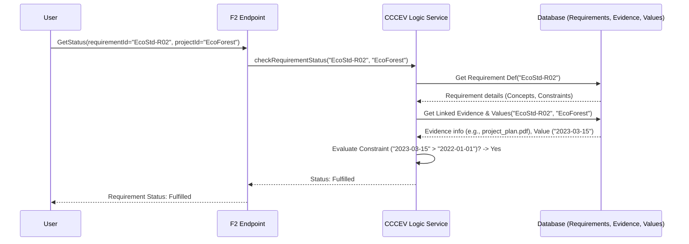

# Chapter 3: CCCEV (Core Criterion and Core Evidence Vocabulary)

In [Chapter 2: Catalogue & Dataset Management (DCAT/DCAT-AP)](02_catalogue___dataset_management__dcat_dcat_ap__.md), we learned how `trace-registry` uses catalogues and datasets (following the DCAT/DCAT-AP standard) to describe and organize information about projects and assets, much like a digital library. We now know how to "catalogue our books".

But what about the rules? How do we define the specific conditions a project must meet to be valid, or what proof is needed to verify a claim? For example, how do we formally state that our "EcoForest Planting Initiative" needs a specific land ownership document to qualify for carbon credits, and how do we track that this proof has been provided?

This is where **CCCEV (Core Criterion and Core Evidence Vocabulary)** comes in.

## What's the Big Idea? Defining Rules and Linking Proof

Imagine you're applying for a driver's license. There's a list of requirements you need to meet:
*   Be over a certain age.
*   Pass a vision test.
*   Pass a written test.
*   Pass a driving test.

For each requirement, you need to provide *evidence* (proof):
*   Your birth certificate or ID card (proves age).
*   A certificate from the optometrist (proves vision).
*   Your test results sheet (proves you passed the written test).
*   A signed form from the examiner (proves you passed the driving test).

CCCEV provides a standardized way to do exactly this, but for things like environmental projects, compliance processes, or any workflow where rules must be followed and proven.

**CCCEV helps us:**

1.  **Define Requirements:** Clearly state what needs to be achieved, proven, or answered (like the items on the driver's license checklist).
2.  **Link Evidence:** Connect these requirements to the specific data or documents that demonstrate fulfillment (like linking the age requirement to your ID card).

Think of CCCEV as a universal language for setting rules (**Criteria**/**Requirements**) and specifying the **Evidence** needed to prove compliance. It creates a structured system for tracking whether rules are met, ensuring everyone understands the requirements and the proof needed.

## Key Concepts: The Building Blocks of Rules and Proof

CCCEV has a few core concepts, based on the official standard described in `vocabulary/CCCEV.md`. Let's break them down:

1.  **Requirement:**
    *   **What it is:** The fundamental concept representing a condition, prerequisite, question, or obligation that needs to be addressed.
    *   **Think of it like:** An item on a checklist or a question in a form.
    *   **Example:** "Is the project located within the designated 'Green Valley' region?" or "Provide proof of land ownership."
    *   **Sub-types:** CCCEV uses specific types of Requirements for clarity:
        *   **Criterion:** A Requirement used specifically for evaluation or assessment, often leading to a decision (pass/fail, eligible/ineligible, scoring). Example: "Project's estimated annual CO2 capture must be greater than 1,000 tonnes."
        *   **Information Requirement:** A direct request for a specific piece of information or data. Example: "Provide the project's official start date."
        *   **Constraint:** A specific limitation or rule applied to a piece of information (often linked to an Information Requirement). Example: "The project start date must be after January 1st, 2022."

2.  **Evidence:**
    *   **What it is:** The data, document, or other proof that demonstrates whether a Requirement is met.
    *   **Think of it like:** The document you submit to prove you meet a checklist item (your ID card, the test certificate).
    *   **Example:** A scanned land title document, a data entry showing the project start date, a signed audit report.

3.  **Information Concept:**
    *   **What it is:** A specific, defined piece of information that a Requirement might ask for, or that Evidence might provide. It helps structure the data.
    *   **Think of it like:** The specific field on a form ("Date of Birth", "License Number") or a specific data point ("Project Start Date", "Land Title ID").
    *   **Why use it?** It makes requirements more precise and allows for potentially automating checks. If a Requirement needs the "Project Start Date" (Information Concept), the system can look for that specific piece of data within the provided Evidence.
    *   **Example:** The Requirement "Provide the project's official start date" uses the Information Concept "Project Start Date". The Evidence (e.g., a project plan document) might contain this information.

4.  **Evidence Type / Evidence Type List:**
    *   **What it is:** Specifies the *kind* or *format* of Evidence that is acceptable for a Requirement. An Evidence Type List allows specifying alternatives (e.g., "Provide Document A *OR* Document B") or combinations ("Provide Document A *AND* Document B").
    *   **Think of it like:** The instructions saying "Acceptable proof of age: Birth Certificate, Passport, or National ID Card".
    *   **Example:** For the "Proof of land ownership" Requirement, the acceptable Evidence Types might be "Official Land Registry Title" or "Notarized Long-Term Lease Agreement".

5.  **Supported Value:**
    *   **What it is:** The actual value extracted from an Evidence that corresponds to a specific Information Concept.
    *   **Think of it like:** The actual date "1990-05-20" written in the "Date of Birth" field on your submitted ID card.
    *   **Example:** If the Evidence is a data file containing `{"projectStartDate": "2023-03-15"}`, the Supported Value for the Information Concept "Project Start Date" is "2023-03-15".

6.  **Reference Framework:**
    *   **What it is:** The standard, regulation, law, or methodology from which the Requirements are derived.
    *   **Think of it like:** The official "Driver's Licensing Rulebook" or the specific "Carbon Credit Standard Document (e.g., Verra VCS Standard v4.3)".
    *   **Example:** Our "EcoForest" project might follow requirements derived from the "National Reforestation Guideline v2.0".

Here's a diagram showing the main relationships:

```mermaid
graph LR
    RF(Reference Framework) --> R(Requirement);
    R -- asks for --> IC(Information Concept);
    R -- expects --> ETL(Evidence Type List);
    ETL -- contains --> ET(Evidence Type);
    E(Evidence) -- proves --> R;
    E -- conforms to --> ET;
    E -- contains --> SV(Supported Value);
    SV -- provides value for --> IC;

    subgraph Requirement Types
        ReqBase(Requirement)
        Crit(Criterion)
        InfoReq(Information Requirement)
        Cons(Constraint)
    end

    ReqBase <|-- Crit;
    ReqBase <|-- InfoReq;
    ReqBase <|-- Cons;
    Cons -- constrains --> IC;
```

This diagram shows that a `Reference Framework` can lead to `Requirement`s. A `Requirement` asks for specific `Information Concept`s and expects certain `Evidence Type`s (grouped in `Evidence Type List`s). An `Evidence` document proves a `Requirement`, conforms to an `Evidence Type`, and contains `Supported Value`s which provide data for `Information Concept`s. `Requirement` itself has subtypes like `Criterion`, `Information Requirement`, and `Constraint`.

## How to Use It: Defining Rules for "EcoForest"

Let's apply CCCEV to our "EcoForest Planting Initiative". Suppose it needs to meet criteria from a fictional "EcoStandard v1.0" (our Reference Framework) to be eligible for credits.

**Step 1: Define the Requirements**

We define the rules from "EcoStandard v1.0" using CCCEV structures. This might be done when setting up the standard within `trace-registry`.

*   **Requirement 1: Land Tenure Secured**
    *   Type: `Information Requirement`
    *   Identifier: `EcoStd-R01`
    *   Name: "Verify Land Ownership/Lease"
    *   Description: "Project must provide proof of legal right to use the land for the project duration."
    *   Has Information Concept: `Land Tenure Document ID` (Type: String)
    *   Has Evidence Type List: `ETL-LandDocs` (contains `ET-LandTitle` and `ET-LeaseAgreement`)
        *   Evidence Type: `ET-LandTitle` (Name: "Official Land Registry Title")
        *   Evidence Type: `ET-LeaseAgreement` (Name: "Notarized Long-Term Lease Agreement (>20 years)")
    *   Is Derived From: `ReferenceFramework: EcoStandard v1.0`

*   **Requirement 2: Start Date Eligibility**
    *   Type: `Criterion`
    *   Identifier: `EcoStd-R02`
    *   Name: "Project Start Date Eligibility"
    *   Description: "Project activities must have commenced after the standard's effective date (Jan 1, 2022)."
    *   Has Information Concept: `Project Start Date` (Type: Date)
    *   Has Requirement (Constraint): `Cons-StartDate`
        *   Constraint `Cons-StartDate`: Constrains `Project Start Date`, Expression: `value > 2022-01-01`
    *   Has Evidence Type List: `ETL-ProjDocs` (contains `ET-ProjPlan`)
        *   Evidence Type: `ET-ProjPlan` (Name: "Official Project Plan Document")
    *   Is Derived From: `ReferenceFramework: EcoStandard v1.0`

**Conceptual Code Snippet (Defining a Requirement):**

This is how defining a requirement might look conceptually using a Kotlin DSL (Domain Specific Language), inspired by `EligibilityRequirements.kt` but simplified:

```kotlin
// Simplified concept for defining Requirement 1
val verifyLandTenure = informationRequirement { // Type: InformationRequirement
    identifier = "EcoStd-R01"
    name = "Verify Land Ownership/Lease"
    description = "..."
    isDerivedFrom { +ecoStandardV1 } // Link to Reference Framework

    hasConcept { // Define needed Information Concept
        identifier = "LandTenureDocID"
        name = "Land Tenure Document ID"
        type = XSDString // Expecting a string (like a document number)
    }

    hasEvidenceTypeList { // Define acceptable Evidence Types
        identifier = "ETL-LandDocs"
        specifiesEvidenceType {
            identifier = "ET-LandTitle"
            name = "Official Land Registry Title"
        }
        specifiesEvidenceType {
            identifier = "ET-LeaseAgreement"
            name = "Notarized Long-Term Lease Agreement (>20 years)"
        }
    }
}

// Result: This definition is stored in the system, ready to be used.
```
This snippet defines the "Verify Land Ownership/Lease" requirement, specifies the kind of information needed (`LandTenureDocID`), and lists the types of documents (`ET-LandTitle`, `ET-LeaseAgreement`) that can be used as proof.

**Step 2: Provide Evidence**

The organization running the "EcoForest" project uploads their documents to `trace-registry`.

*   Upload `land_title_scan.pdf`
*   Upload `project_plan_final.pdf`

**Step 3: Link Evidence to Requirements**

The system (or a user) links the uploaded evidence to the requirements they fulfill.

*   Link `land_title_scan.pdf` to Requirement `EcoStd-R01`.
    *   The system might ask the user to confirm this document is of Type `ET-LandTitle`.
    *   Optionally, extract the `Land Tenure Document ID` from the PDF (manually or automatically) and store it as a `Supported Value`.
*   Link `project_plan_final.pdf` to Requirement `EcoStd-R02`.
    *   The system confirms this is of Type `ET-ProjPlan`.
    *   Extract the `Project Start Date` (e.g., "2023-03-15") and store it as a `Supported Value`.

**Conceptual Code Snippet (Linking Evidence):**

```kotlin
// Simplified concept for linking evidence
linkEvidenceToRequirement(
    requirementId = "EcoStd-R01",
    evidence = uploadedEvidence( // Represents land_title_scan.pdf
        file = "land_title_scan.pdf",
        type = "ET-LandTitle" // User confirms the type
    ),
    supportedValues = listOf( // User provides extracted value
        supportedValue(
            conceptIdentifier = "LandTenureDocID",
            value = "LT-GV-12345"
        )
    )
)

// Result: The system now knows that land_title_scan.pdf fulfills
// EcoStd-R01 and contains the value "LT-GV-12345" for the document ID.
```
This conceptual call tells the system that `land_title_scan.pdf` is the proof for requirement `EcoStd-R01`, it's the correct type (`ET-LandTitle`), and it contains the specific document ID "LT-GV-12345".

**Step 4: Assess Fulfillment**

The system can now check if requirements are met:

*   **EcoStd-R01:** Fulfilled because linked evidence (`land_title_scan.pdf`) matches an allowed type (`ET-LandTitle` is in `ETL-LandDocs`).
*   **EcoStd-R02:** Check the `Supported Value` for `Project Start Date` ("2023-03-15"). Apply the Constraint (`value > 2022-01-01`). Since "2023-03-15" is after "2022-01-01", the requirement is fulfilled.

Using CCCEV provides a clear, structured, and potentially automatable way to manage compliance and verification.

## Under the Hood: How Does It Work?

When you define requirements or link evidence, the system uses various components.

**Simplified Walkthrough (Checking Requirement Status):**

1.  **Request:** You ask the system for the status of Requirement `EcoStd-R02` ("Project Start Date Eligibility") for the "EcoForest" project.
2.  **API Endpoint:** An F2 API endpoint (likely related to `cccev-f2-api`) receives the request. You'll learn more about these in [Chapter 4: F2 Function-Based APIs](04_f2_function_based_apis_.md).
3.  **CCCEV Service:** The request is passed to a service that understands CCCEV logic. This service looks up the definition of `EcoStd-R02`.
4.  **Data Retrieval:** The service fetches:
    *   The Requirement definition (including its associated Information Concepts like `Project Start Date` and Constraints like `Cons-StartDate`).
    *   Any Evidence linked to this requirement for the specific project (e.g., `project_plan_final.pdf`).
    *   Any `Supported Value`s extracted from the evidence (e.g., `Project Start Date` = "2023-03-15").
5.  **Evaluation:** The service applies the logic:
    *   Does linked evidence exist? (Yes, `project_plan_final.pdf`)
    *   Does the evidence type match? (Assume yes)
    *   Is the `Supported Value` available? (Yes, "2023-03-15")
    *   Does the value satisfy the Constraint (`> 2022-01-01`)? (Yes)
6.  **State Update (Optional):** The system might record the outcome (e.g., Requirement Fulfilled). This could involve [S2 Event Sourcing & State Management](05_s2_event_sourcing___state_management_.md).
7.  **Response:** The system returns the status: "Fulfilled".

Here's a simplified sequence diagram:



**Code Glimpse:**

*   **Defining Requirements:** Files like `platform/script/script-init/src/main/kotlin/io/komune/registry/script/init/cccev/requirement/EligibilityRequirements.kt` use a DSL (Domain Specific Language) built on CCCEV concepts to define sets of requirements for specific standards or processes.

    ```kotlin
    // Simplified from EligibilityRequirements.kt
    val IdentificationOfProject = eligibilityActivity { // Defines a group of requirements
        identifier = "B11"
        name = "Identification of the project"
        // ... (derived from framework, etc.)

        hasConcept { // Defines an Information Concept within this requirement
            eligibilityStep { // Helper function to create a concept
                identifier = "B101"
                name = "Project name"
                description = "Provide a name for the project."
                // This concept implicitly becomes part of the 'IdentificationOfProject' requirement
            }
        }
        // ... more concepts ...
    }
    ```
    This shows how requirements (`IdentificationOfProject`) are grouped and contain specific `hasConcept` blocks defining the information needed (`Project name`).

*   **Core Models:** The fundamental CCCEV classes (Requirement, Evidence, InformationConcept, etc.) and their relationships are defined as data structures (often Kotlin data classes) within the `cccev-domain` modules (like `platform/data/s2/cccev/cccev-domain/`). These models align with the official CCCEV specification (`vocabulary/CCCEV.md`).
    *   For example, `DataUnitModel.kt` (in `platform/data/s2/cccev/cccev-domain/src/commonMain/kotlin/io/komune/registry/s2/cccev/domain/model/`) might define structures for units used in concepts.
    *   `S2InformationConcept.kt` (in `platform/data/s2/cccev/cccev-domain/src/commonMain/kotlin/io/komune/registry/s2/cccev/domain/`) defines the state machine (lifecycle) for Information Concepts using S2, which you'll learn about in [Chapter 5: S2 Event Sourcing & State Management](05_s2_event_sourcing___state_management_.md).

*   **API Layer:** The F2 API layer (`platform/data/f2/cccev-f2/cccev-f2-api/`) provides the functions to interact with CCCEV objects – creating requirements, linking evidence, querying status, etc. These F2 functions orchestrate calls to the underlying domain logic and data storage.

## Conclusion

You've now learned about CCCEV, the standard vocabulary `trace-registry` uses to define **Requirements** (the rules and conditions) and link them to **Evidence** (the proof).

We covered:
*   The core concepts: Requirement (Criterion, Information Requirement, Constraint), Evidence, Information Concept, Evidence Type, Supported Value, and Reference Framework.
*   How these concepts work together like a structured checklist and filing system for compliance.
*   A practical example of defining requirements for our "EcoForest" project and linking evidence.
*   A high-level look at how the system processes these requests internally.

CCCEV is crucial for ensuring clarity, consistency, and traceability in processes that require verification and validation. It provides the framework for managing the *rules* of the game.

Now that we understand the core data models for Projects/Assets (Chapter 1), how to catalogue them (Chapter 2), and how to define rules and evidence for them (Chapter 3), how do we actually *interact* with the `trace-registry` system to perform actions like creating a project, issuing an asset, or linking evidence?

Let's move on to [Chapter 4: F2 Function-Based APIs](04_f2_function_based_apis_.md) to learn about the API layer that exposes the system's capabilities.

---

Generated by [AI Codebase Knowledge Builder](https://github.com/The-Pocket/Tutorial-Codebase-Knowledge)