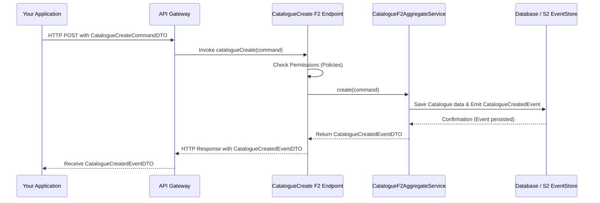

# Chapter 4: F2 Function-Based APIs

In [Chapter 3: CCCEV (Core Criterion and Core Evidence Vocabulary)](03_cccev__core_criterion_and_core_evidence_vocabulary__.md), we learned how `trace-registry` defines rules (Requirements) and links them to proof (Evidence) using the CCCEV standard. We now understand the structure for managing compliance and verification.

But how do we actually *tell* the system to do things? For example, how do we instruct `trace-registry` to create a new Project, issue an Asset, define a CCCEV Requirement, or fetch details about a Catalogue? We've learned about the *what* (the data models and concepts), but now let's explore the *how* – how we interact with the system's capabilities. This is where F2 Function-Based APIs come into play.

## What's the Big Idea? Specialized Workers for Every Task

Imagine a highly organized workshop. Instead of one person trying to do everything, there are many specialized workers.
*   One worker is an expert at "Creating Project Folders."
*   Another worker only handles "Issuing New Certificates."
*   A third worker is solely responsible for "Fetching Item Details from Storage."

In `trace-registry`, the backend system exposes its functionalities in a similar way. Instead of traditional REST APIs where you might use HTTP verbs like `POST /projects` or `GET /catalogues/{id}`, many operations are defined as **F2 Functions**.

Think of an F2 Function as one of these specialized workers. You give this worker:
1.  A specific **"Command"**: An instruction to *do* something or *change* something in the system (e.g., "Please create a new catalogue with these details").
2.  Or a specific **"Query"**: A request for *information* (e.g., "Please give me the details for this catalogue ID").

The worker (the F2 Function) then performs its single, well-defined task and gives you back:
*   A **result** (the information you asked for in a query).
*   Or an **"Event"** (a notification indicating what happened as a result of your command, like "CatalogueSuccessfullyCreated").

This approach aims for a very clean, focused, and often event-driven API design. Each function does one thing, and does it well.

Let's say our central use case is: **We want to create a new "Catalogue" in `trace-registry` to list "Local Renewable Energy Initiatives."** How do we use F2 Functions to achieve this?

## Key Concepts: Commands, Queries, and Functions

Let's break down the main components of this F2 approach:

1.  **F2 Function:**
    *   **What it is:** A self-contained piece of code on the backend that performs a single, specific operation. It's the "specialized worker."
    *   **How it's identified:** Each F2 Function has a unique name or identifier, often related to the action it performs (e.g., `catalogueCreateFunction`, `projectGetFunction`).
    *   **Example:** There's likely an F2 Function dedicated to creating catalogues, another for fetching project details, and so on.

2.  **Command (and CommandDTOs):**
    *   **What it is:** An instruction to the system to perform an action that changes data or state. It's the "work order" you give to a worker.
    *   **DTO (Data Transfer Object):** Commands are typically packaged as DTOs. These are simple objects whose main purpose is to carry data between processes. So, a `CatalogueCreateCommandDTO` would carry all the necessary information (title, description, type, etc.) to create a new catalogue.
    *   **Examples:**
        *   `CatalogueCreateCommandDTO`: "Create a new catalogue."
        *   `AssetIssueCommandDTO` (from [Chapter 1: Project & Asset Management](01_project___asset_management_.md)): "Issue new assets into this pool."
        *   `RequirementCreateCommandDTO` (related to [Chapter 3: CCCEV (Core Criterion and Core Evidence Vocabulary)](03_cccev__core_criterion_and_core_evidence_vocabulary__.md)): "Define this new requirement."

3.  **Query (and QueryDTOs):**
    *   **What it is:** A request to the system to retrieve information. It does *not* change any data. It's like asking a worker for a report or a specific item from the shelves.
    *   **DTO (Data Transfer Object):** Queries are also often packaged as DTOs. A `CatalogueGetQueryDTO` would carry the ID of the catalogue you want to fetch.
    *   **Examples:**
        *   `CatalogueGetQueryDTO`: "Get details for this catalogue."
        *   `ProjectPageQueryDTO` (from [Chapter 1: Project & Asset Management](01_project___asset_management_.md)): "Get me a list (page) of projects matching these criteria."
        *   `DatasetGetFunction` (related to [Chapter 2: Catalogue & Dataset Management (DCAT/DCAT-AP)](02_catalogue___dataset_management__dcat_dcat_ap__.md)): "Fetch information for this dataset."

4.  **Result/Event (and EventDTOs/ResultDTOs):**
    *   **What it is:** What the F2 Function gives back after processing a command or query.
    *   **For Commands (Events):** Typically, a command results in an "Event". This event describes what happened. For example, `CatalogueCreatedEventDTO` signifies that a catalogue was successfully created and might contain the ID of the new catalogue. This is key for event-driven architectures and will be explored more in [Chapter 5: S2 Event Sourcing & State Management](05_s2_event_sourcing___state_management_.md).
    *   **For Queries (Results):** A query returns a "Result" containing the requested data. For example, `CatalogueGetResultDTO` would contain the detailed information of the fetched catalogue.
    *   **DTOs again:** These outcomes are also packaged as DTOs.

This F2 approach makes the API very explicit. You know exactly which "worker" to talk to and what "paperwork" (DTO) you need to provide.

## How to Use It: Creating Our "Local Renewable Energy Initiatives" Catalogue

Let's walk through our use case: creating a new catalogue.

**Step 1: Identify the Right F2 Function**

We need to create a catalogue. So, we'll be looking for a function like `catalogueCreate`. (The actual naming might vary slightly, but the intent will be clear).

**Step 2: Prepare the "Command" Data (the DTO)**

We need to provide the details for our new catalogue. This means creating an instance of `CatalogueCreateCommandDTO` (or a similar DTO like `CatalogueCreateCommandDTOBase`).

```kotlin
// Simplified Command DTO for creating a catalogue
// This is what we'd prepare to send to the F2 function.
val createCatalogueCommand = CatalogueCreateCommandDTOBase(
    title = "Local Renewable Energy Initiatives",
    description = "A catalogue of renewable energy projects led by local communities.",
    type = "RenewableEnergy", // A category for this catalogue
    language = "en",
    // ... other optional details like parentId, ownerOrganizationId, etc.
)
```
This Kotlin code shows us creating an object `createCatalogueCommand` that holds all the necessary information for our new catalogue.

**Step 3: "Send" the Command to the F2 Function**

Conceptually, we invoke the `catalogueCreate` F2 Function and pass our `createCatalogueCommand` object to it. The `trace-registry` might also allow for an optional image file to be uploaded with the catalogue.

```kotlin
// Simplified concept: calling the F2 function from client code
// (The actual call might be an HTTP request to an endpoint exposed by the F2 function)
val resultEvent = catalogueCreateFunction.invoke(
    Pair(createCatalogueCommand, null /* no image file in this example */)
)

// What happens:
// 1. The `createCatalogueCommand` is sent to the `catalogueCreateFunction` on the backend.
// 2. The backend function processes it (validates, saves to database, etc.).
// 3. It returns an event indicating success or failure.
```
Here, `catalogueCreateFunction.invoke(...)` represents the action of sending our command. The backend receives this command and gets to work.

**Step 4: Receive the "Event" (the Outcome)**

If the catalogue is created successfully, the `catalogueCreateFunction` will return an event, typically something like `CatalogueCreatedEventDTO`. This event DTO will contain information about the newly created catalogue, most importantly its unique ID.

```kotlin
// `resultEvent` from the previous step would be an instance of CatalogueCreatedEventDTO.
// It might look something like this (simplified):
//
// resultEvent = CatalogueCreatedEventDTOBase(
//     id = "cat_7a8b2c9d-f3e1-4a2b-8c7d-6e5f4g3h2i1j", // The new unique ID
//     identifier = "local-renewable-energy-initiatives", // A human-friendly identifier
//     draftId = null // If a draft was also created
// )
//
// Now we know the ID of our new catalogue!
```
We now have confirmation and the `id` of our new "Local Renewable Energy Initiatives" catalogue!

**What about fetching data (Queries)?**

It's a similar process:
1.  **Identify the F2 Query Function:** e.g., `catalogueGet`.
2.  **Prepare the QueryDTO:** e.g., `CatalogueGetQueryDTO(id = "cat_7a8b2c9d-f3e1-4a2b-8c7d-6e5f4g3h2i1j")`.
3.  **Send the Query to the Function:** e.g., `catalogueGetFunction.invoke(myQuery)`.
4.  **Receive the ResultDTO:** e.g., `CatalogueGetResult(catalogue = ...details...)`.

```kotlin
// Simplified Query DTO to get our newly created catalogue
val getCatalogueQuery = CatalogueGetQueryDTO(
    id = "cat_7a8b2c9d-f3e1-4a2b-8c7d-6e5f4g3h2i1j", // ID from the CreatedEvent
    language = "en"
)

// Simplified concept: calling the F2 query function
val catalogueDetailsResult = catalogueGetFunction.invoke(getCatalogueQuery)

// `catalogueDetailsResult` would contain the full details of the catalogue.
// e.g., catalogueDetailsResult.catalogue.title would be "Local Renewable Energy Initiatives"
```

## Under the Hood: How Does an F2 Function Call Work?

Let's peek behind the curtain. When you "call" an F2 Function (e.g., to create a catalogue):

1.  **Client Request:** Your application (or the `trace-registry` web interface) prepares the CommandDTO (e.g., `CatalogueCreateCommandDTOBase`) with the catalogue details.
2.  **API Gateway / Endpoint:** The request, often an HTTP POST, hits an API endpoint. In `trace-registry`, there's an `api-gateway` that routes incoming requests to the correct backend module. This endpoint is specifically bound to an F2 Function (e.g., `catalogueCreate`).
3.  **F2 Function Invocation:** The F2 Function code (defined in a file like `CatalogueEndpoint.kt`) receives the CommandDTO.
4.  **Policy Enforcement (Optional but common):** Before doing any work, the function often checks if the user has permission for this action (e.g., using a `CataloguePoliciesEnforcer`).
5.  **Business Logic Service:** The F2 Function then typically delegates the core work to a specialized "service" or "aggregate" (e.g., `CatalogueF2AggregateService` for commands, or `CatalogueF2FinderService` for queries). This service contains the actual business rules.
6.  **Data Interaction & State Change:**
    *   For **Commands**: The service interacts with the database to create or update data. Crucially, it will often record an "event" (like `CatalogueCreated`) using a system like S2 (which we'll cover in [Chapter 5: S2 Event Sourcing & State Management](05_s2_event_sourcing___state_management_.md)). This event becomes the source of truth.
    *   For **Queries**: The service fetches data from the database.
7.  **Response Generation:** The service returns a result (an EventDTO for commands, or a ResultDTO for queries) back to the F2 Function.
8.  **Client Response:** The F2 Function endpoint packages this DTO into an HTTP response and sends it back to your application.

Here's a simplified sequence diagram for our `catalogueCreate` example:



### Diving Deeper into the Code

Let's look at some representative code snippets:

1.  **F2 Function Definition (in an `*Endpoint.kt` file):**
    This is where an F2 Function is exposed. The `f2Function` builder is a common pattern.

    ```kotlin
    // Simplified from: platform/data/f2/catalogue-f2/catalogue-f2-api/src/main/kotlin/io/komune/registry/f2/catalogue/api/CatalogueEndpoint.kt

    @Bean // Tells Spring framework to manage this function
    override fun catalogueCreate(): CatalogueCreateFunction = f2Function { (command, imageFilePair) ->
        val cmd = command as CatalogueCreateCommandDTOBase // Type cast
        logger.info("catalogueCreate: $cmd") // Log the incoming command

        cataloguePoliciesEnforcer.checkCreate(cmd.type) // Permission check

        // Delegate to the service that knows how to create catalogues
        val event = catalogueF2AggregateService.create(cmd)

        // (Simplified: image handling would be here if imageFilePair is not null)

        event // Return the resulting event
    }
    ```
    *   `@Bean`: Makes this function discoverable by the system.
    *   `f2Function { ... }`: A lambda defining the function's behavior. It receives the input (our `command` DTO and an optional `imageFile`).
    *   It logs, checks policies, and then calls `catalogueF2AggregateService.create(...)` to do the actual work.

2.  **Command/Query DTOs (in `*-domain` modules):**
    These define the structure of the data sent to and from functions.

    ```kotlin
    // Simplified from: platform/data/f2/catalogue-f2/catalogue-f2-domain/src/commonMain/kotlin/io/komune/registry/f2/catalogue/domain/command/CatalogueCreateCommandDTO.kt

    @Serializable // Means this object can be easily converted to formats like JSON
    data class CatalogueCreateCommandDTOBase(
        override val identifier: CatalogueIdentifier? = null,
        override val title: String,
        override val description: String? = null,
        override val type: String,
        // ... many other fields for catalogue details
    ): CatalogueCreateCommandDTO // Implements a shared interface
    ```
    *   `@Serializable`: A Kotlin annotation indicating this class can be serialized (e.g., to JSON for network transmission).
    *   `data class`: A concise way in Kotlin to create classes primarily for holding data.

3.  **API Interface (e.g., `CatalogueApi.kt`):**
    These interfaces group related F2 functions for a specific domain (like "Catalogue").

    ```kotlin
    // From: platform/data/f2/catalogue-f2/catalogue-f2-domain/src/commonMain/kotlin/io/komune/registry/f2/catalogue/domain/CatalogueApi.kt
    /**
     * Defines all F2 functions related to Catalogues.
     * @d2 api
     */
    interface CatalogueApi: CatalogueCommandApi, CatalogueQueryApi

    // CatalogueCommandApi would then list functions like:
    // fun catalogueCreate(): CatalogueCreateFunction
    // fun catalogueDelete(): CatalogueDeleteFunction
    //
    // CatalogueQueryApi would list functions like:
    // fun catalogueGet(): CatalogueGetFunction
    // fun cataloguePage(): CataloguePageFunction
    ```
    This provides a clear contract for what operations are available for catalogues. Other domains like "Activity" (`ActivityApi.kt`) would have similar structures.

4.  **Client-Side Interaction (e.g., `CatalogueClient.kt`):**
    On the client side (which could be another backend service, or a frontend application), there's often a generated or written client to make calling these F2 functions easier.

    ```kotlin
    // Simplified from: platform/data/f2/catalogue-f2/catalogue-f2-client/src/commonMain/kotlin/io/komune/registry/f2/catalogue/client/CatalogueClient.kt
    open class CatalogueClient(val client: F2Client) : CatalogueApi {
        // For command functions like catalogueCreate, the client typically makes an HTTP POST.
        // The `F2Client` handles the details of serialization and HTTP.

        // For query functions, it might look like this:
        override fun catalogueGet(): CatalogueGetFunction = client.function("data/${this::catalogueGet.name}")
        override fun cataloguePage(): CataloguePageFunction = client.function("data/${this::cataloguePage.name}")
        // ... other query functions
    }
    ```
    *   `F2Client`: A helper library that simplifies making the actual network calls to the F2 Function endpoints. It handles things like setting up HTTP requests and serializing/deserializing DTOs.

5.  **API Gateway (`api-gateway/build.gradle.kts`):**
    The API Gateway is the main entry point for external requests. It knows about all the different F2 API modules.

    ```gradle
    // From: platform/api/api-gateway/build.gradle.kts
    dependencies {
        // F2 framework support
        Dependencies.Jvm.f2(::implementation)

        // Include all project modules that end with "-api" (like catalogue-f2-api)
        project(":platform").dependencyProject.subprojects.forEach {
            if ("-api" in it.name) {
                implementation(it) // This makes their F2 functions available to the gateway
            }
        }
        // ...
    }
    ```
    This Gradle configuration snippet shows the `api-gateway` project including dependencies on all modules whose names contain `-api`. This is how it discovers and can route requests to various F2 Function endpoints like those in `catalogue-f2-api`, `dataset-f2-api`, etc.

## Conclusion

You've now learned about **F2 Function-Based APIs**, the primary way to interact with `trace-registry`.

*   Instead of general-purpose REST endpoints, `trace-registry` uses specialized **F2 Functions** – think of them as dedicated workers.
*   You interact with these functions by sending **Commands** (to perform actions, resulting in **Events**) or **Queries** (to retrieve data, resulting in **Results**).
*   These commands, queries, events, and results are packaged as **DTOs** (Data Transfer Objects).
*   This approach leads to a clean, focused, and explicit API design.

We've seen how to conceptually create a catalogue by preparing a `CatalogueCreateCommandDTO`, sending it to a `catalogueCreate` F2 function, and receiving a `CatalogueCreatedEventDTO`. This pattern applies to most interactions within `trace-registry`.

Now that we understand how to send commands that are intended to change the state of our system (like issuing an asset or creating a project), a new question arises: how does `trace-registry` ensure these changes are reliably recorded and that the system's state is always consistent, especially if many things are happening at once? This brings us to the powerful concept of event sourcing.

Let's move on to [Chapter 5: S2 Event Sourcing & State Management](05_s2_event_sourcing___state_management_.md) to explore how `trace-registry` reliably manages state changes through events.

---

Generated by [AI Codebase Knowledge Builder](https://github.com/The-Pocket/Tutorial-Codebase-Knowledge)