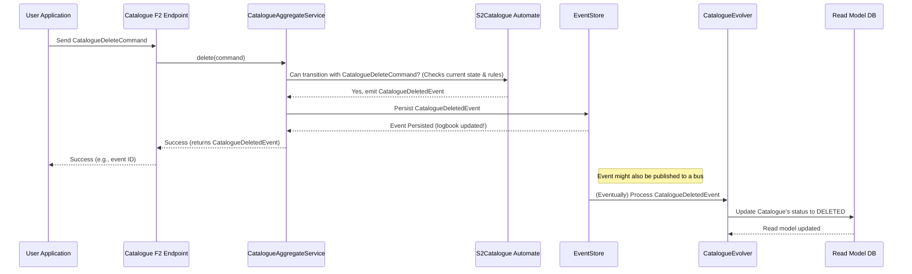

# Chapter 5: S2 Event Sourcing & State Management

In [Chapter 4: F2 Function-Based APIs](04_f2_function_based_apis_.md), we learned how to send commands (like "create a new catalogue") and queries (like "get catalogue details") to `trace-registry` using specialized F2 Functions. These commands tell the system to *do* something, often changing its information.

But how does `trace-registry` remember these changes reliably? If we tell it to create a Catalogue, and then later update its title, and then even later delete it, how does the system keep track of this history and always know the Catalogue's current, correct status? What if multiple users are trying to make changes at the same time? This is where **S2 Event Sourcing & State Management** comes in.

## What's the Big Idea? Remembering Everything with a Perfect Logbook

Imagine you want to understand your bank account balance. You could just look at the current balance, but if you wanted to know *why* it's that amount, you'd look at your statement – a chronological list of all deposits and withdrawals. Each transaction is an "event" that changed your balance.

S2 Event Sourcing works on a similar principle for key entities in `trace-registry`, like Catalogues, Projects, or Asset Pools.

**Central Use Case:** Let's say we have a "Renewable Energy Projects" Catalogue. We've decided this catalogue is no longer needed and we want to **delete** it. How does `trace-registry` handle this "delete" instruction to ensure the catalogue's state is correctly updated to "DELETED" and this action is recorded permanently, following established rules?

Instead of just finding the catalogue's record in a database and changing its status field from "ACTIVE" to "DELETED", S2 Event Sourcing does something more robust:

1.  It records the intention: "A command to delete Catalogue X was received."
2.  If allowed by the rules, it records what happened: "Catalogue X was successfully deleted." This is an **Event**.
3.  This event is stored forever in a logbook, like a new entry in your bank statement.
4.  To know the current state of Catalogue X (is it active? deleted?), the system can look at all the events for Catalogue X in order.

This "logbook" of events provides a full, unchangeable audit trail and history for all changes. The S2 framework helps manage this process.

## Key Concepts: The Building Blocks of S2

Let's break down the core ideas:

1.  **Event:**
    *   **What it is:** A statement of a fact, something that *has happened* in the past. Events are immutable (they cannot be changed once recorded).
    *   **Think of it like:** An entry in a logbook: "Catalogue 'SolarProjects2023' Created on Jan 10." or "Catalogue 'OldTech' Deleted on Nov 5."
    *   **Example in `trace-registry`:** `CatalogueCreatedEvent`, `CatalogueUpdatedEvent`, `CatalogueDeletedEvent`.

2.  **Event Sourcing:**
    *   **What it is:** An architectural pattern where the state of an application is determined by a sequence of events. Instead of storing the *current state* directly and overwriting it, we store *all the events* that led to the current state.
    *   **Think of it like:** Your bank account. The current balance isn't just a number stored somewhere; it's the result of replaying all your past deposits and withdrawals (events).

3.  **State:**
    *   **What it is:** The current condition or status of an entity at a specific point in time.
    *   **Example:** A Catalogue can be in an `ACTIVE` state or a `DELETED` state.
    *   **How it's derived:** In event sourcing, the current state is derived by replaying all the relevant events for that entity in chronological order.

4.  **S2 Automate (The S2 Framework):**
    *   **What it is:** The specific library and set of tools within `trace-registry` that implements event sourcing and state management. "S2" stands for "Simple Sourcing".
    *   **It helps define and manage:**
        *   **Aggregates:** These are the entities whose state is managed by S2 (e.g., a `Catalogue`, an `AssetPool`, a `Project`). An aggregate is a consistency boundary, meaning all changes to it are treated as a single operation.
        *   **State Machine:** For each aggregate type, S2 defines its possible states and the valid transitions between them. Think of it as a flowchart dictating what can happen when. For example, a `Catalogue` might go from `ACTIVE` to `DELETED`, but not directly from `DELETED` back to `ACTIVE`.
        *   **Commands:** These are requests to change the state of an aggregate (as we saw in [Chapter 4: F2 Function-Based APIs](04_f2_function_based_apis_.md)). A command (e.g., `CatalogueDeleteCommand`) is processed by S2. If valid according to the state machine, it results in one or more events (e.g., `CatalogueDeletedEvent`).
        *   **Evolver (or View/Projection):** This is a component that takes an event and applies it to update a *read model* or a *view* of the aggregate's current state. While the true state is the sequence of events, for quick queries, it's often useful to have an up-to-date snapshot. The Evolver builds this snapshot.

Let's see how S2 helps us delete our "Renewable Energy Projects" Catalogue.

## How to Use It: Deleting a Catalogue with S2

**Step 1: Define the S2 State Machine for a `Catalogue`**

Somewhere in the code, usually in a domain module, the rules for a `Catalogue` are defined using S2. This includes its possible states and what commands can cause transitions between them.

```kotlin
// Simplified from: platform/data/s2/catalogue/catalogue-domain/src/commonMain/kotlin/io/komune/registry/s2/catalogue/domain/automate/S2Catalogue.kt
// This defines the lifecycle rules for a Catalogue.

val s2Catalogue = s2Sourcing { // Start defining the S2 state machine for "Catalogue"
    name = "Catalogue"

    // Rule for creating a Catalogue
    init<CatalogueCreateCommand, CatalogueCreatedEvent> {
        to = CatalogueState.ACTIVE // New catalogues start as ACTIVE
        role = CatalogueRole.Issuer // Specifies who can perform this
    }

    // Rule for deleting a Catalogue
    transaction<CatalogueDeleteCommand, CatalogueDeletedEvent> {
        from = CatalogueState.ACTIVE    // Can only delete if currently ACTIVE
        to = CatalogueState.DELETED     // Changes state to DELETED
        role = CatalogueRole.Issuer     // Specifies who can perform this
    }
    // ... other rules for updating, linking, etc. ...
}

// Defines the possible states a Catalogue can be in
enum class CatalogueState(override val position: Int): S2State {
    ACTIVE(0),
    DELETED(1)
}
```
*   This S2 definition uses a builder (`s2Sourcing`) to specify the `Catalogue` state machine.
*   `init` defines how a `Catalogue` is created (`CatalogueCreateCommand` leads to `CatalogueCreatedEvent`, setting state to `ACTIVE`).
*   `transaction` defines other state changes. The one for `CatalogueDeleteCommand` says:
    *   It can only happen if the catalogue is currently in the `ACTIVE` state (`from = CatalogueState.ACTIVE`).
    *   It results in a `CatalogueDeletedEvent`.
    *   The catalogue's new state will be `DELETED` (`to = CatalogueState.DELETED`).
    *   Only users with the `CatalogueRole.Issuer` role can do this.

This `S2Catalogue.kt` file, along with similar files like `S2AssetPool.kt` for Asset Pools, `S2Dataset.kt` for Datasets, `S2Project.kt` for Projects, and `S2CatalogueDraft.kt` for draft catalogues, essentially write down the "rules of the game" for these entities.

**Step 2: Send a `CatalogueDeleteCommand`**

As we learned in [Chapter 4: F2 Function-Based APIs](04_f2_function_based_apis_.md), our application (or another service) would send a `CatalogueDeleteCommand` via an F2 Function. This command would specify the ID of the catalogue to be deleted.

```kotlin
// Conceptual: Preparing and sending the command
val deleteCommand = CatalogueDeleteCommand(
    id = "catalogue-renewable-energy-id" // ID of the catalogue to delete
)

// This command is then sent via an F2 function, for example:
// catalogueF2AggregateService.delete(deleteCommand)
```

**Step 3: S2 Processes the Command & Emits an Event**

The F2 function delegates the command to an "Aggregate Service" (like `CatalogueAggregateService.kt`) that uses the S2 automate engine.
1.  The S2 engine for `Catalogue` receives the `CatalogueDeleteCommand`.
2.  It checks the current state of `catalogue-renewable-energy-id`. Let's say it's `ACTIVE`.
3.  It consults the `S2Catalogue` state machine rules: Is a transition from `ACTIVE` via `CatalogueDeleteCommand` allowed? Yes.
4.  If allowed, it generates a `CatalogueDeletedEvent`.

```kotlin
// Inside CatalogueAggregateService.kt (simplified)
// It uses the 'automate' (the S2 engine for Catalogues)
suspend fun delete(command: CatalogueDeleteCommand): CatalogueDeletedEvent = automate.transition(command) {
    // 'it' here refers to the current state of the catalogue being processed.
    // This block creates the event if the transition is valid.
    CatalogueDeletedEvent(
        id = it.id, // The ID of the catalogue from its current state
        date = System.currentTimeMillis(), // Timestamp of when it happened
    )
}
```
This `automate.transition` call is where the magic happens. It ensures rules are followed and, if so, helps create the event.

**Step 4: The Event is Stored**

The `CatalogueDeletedEvent` is then permanently stored in an "event store" – our chronological logbook. This is the crucial step in event sourcing. It's the undeniable record that this catalogue was deleted.

**Step 5: The State (Read Model) is Updated via an Evolver**

While the true history is in the event store, for practical purposes (like quickly displaying a list of catalogues and their statuses), `trace-registry` maintains a "read model" or "projection" of the current state. An **Evolver** is responsible for updating this read model.

The `CatalogueEvolver.kt` listens for new `CatalogueEvent`s. When it sees our `CatalogueDeletedEvent`:

```kotlin
// Simplified from: platform/data/s2/catalogue/catalogue-api/src/main/kotlin/io/komune/registry/program/s2/catalogue/api/CatalogueEvolver.kt
// This class updates the 'current state' view of a Catalogue based on events.

class CatalogueEvolver: View<CatalogueEvent, CatalogueEntity> { // View is an S2 concept for Evolvers
    override suspend fun evolve(event: CatalogueEvent, model: CatalogueEntity?): CatalogueEntity? = when (event) {
        is CatalogueCreatedEvent -> { /* create new CatalogueEntity from event ... */ }
        is CatalogueUpdatedEvent -> { /* update model based on event ... */ }
        
        is CatalogueDeletedEvent -> model?.apply { // If we get a CatalogueDeletedEvent
            status = CatalogueState.DELETED      // Update the status in our model
            this.modified = event.date           // Record modification time
        }
        // ... other event types ...
        else -> model // If event is not handled, return model unchanged
    }
}
// An 'CatalogueEntity' would be a data class representing the fields of a catalogue 
// stored in a regular database for fast queries.
```
The `evolve` function takes the event (`CatalogueDeletedEvent`) and the current state of the catalogue (`model`). It then returns the *new* state of the `model` after applying the event. This updated `CatalogueEntity` (with status `DELETED`) would then be saved to a database that stores these current-state views.

**Outcome:**
*   The `CatalogueDeletedEvent` is permanently logged.
*   The read model for "catalogue-renewable-energy-id" now shows its status as `DELETED`.
*   Anyone querying for this catalogue will see it as deleted or it might not show up in active lists.

## Under the Hood: The S2 Flow

Let's visualize the general flow when a command is processed by S2:

1.  **Command Input:** An F2 Function receives a command (e.g., `CatalogueDeleteCommand`).
2.  **Aggregate Service:** The F2 Function passes the command to the relevant S2 Aggregate Service (e.g., `CatalogueAggregateService`).
3.  **S2 Automate:**
    *   The Aggregate Service uses the S2 `automate` instance specific to that aggregate type (e.g., `s2Catalogue`).
    *   The `automate` fetches the current state (or replays events if necessary) of the target aggregate.
    *   It validates if the command is allowed in the current state according to the defined state machine transitions.
4.  **Event Generation:** If valid, the `automate` (with help from the Aggregate Service logic) generates a new event (e.g., `CatalogueDeletedEvent`).
5.  **Event Persistence:** This new event is saved to the Event Store (the primary source of truth).
6.  **Event Publishing (Optional):** The event might be published to an internal event bus.
7.  **Evolver Processing:**
    *   One or more Evolvers (like `CatalogueEvolver`) subscribe to relevant events.
    *   Upon receiving the new event, the Evolver updates its specific read model (projection) of the aggregate's state. This read model is often stored in a traditional database optimized for queries.
8.  **Response:** The F2 Function typically returns the ID of the event that was generated, confirming the action.

Here's a simplified sequence diagram for our `CatalogueDeleteCommand` example:


*(The Evolver step can happen synchronously or asynchronously after the event is persisted).*

This S2 architecture ensures that:
*   **All changes are captured as immutable events:** Creating a reliable audit trail.
*   **State transitions follow predefined rules:** Maintaining data integrity and consistency.
*   **The system can be resilient:** If a read model gets corrupted, it can be rebuilt by replaying events.
*   **Complex business logic can be clearly modeled:** State machines make it easier to understand an entity's lifecycle.

## Conclusion

You've now explored **S2 Event Sourcing & State Management**, the robust mechanism `trace-registry` uses to remember and update information for key entities like Catalogues and Projects.

We've learned that:
*   Instead of directly modifying data, `trace-registry` records changes as **Events** in a chronological log.
*   The **current state** of an entity is derived by replaying these events.
*   The **S2 framework** (with its `Automate`, `State Machines`, `Commands`, and `Evolvers`) manages this process, ensuring changes follow defined rules.
*   This approach provides a full audit trail, enhances data integrity, and allows for clear modeling of entity lifecycles. Files like `S2Catalogue.kt`, `S2AssetPool.kt`, `S2Dataset.kt`, `S2Project.kt`, and `S2CatalogueDraft.kt` define these lifecycles.
*   Services like `CatalogueAggregateService.kt` orchestrate command processing and event generation, while `CatalogueEvolver.kt` updates readable state projections.

Understanding S2 is key to grasping how `trace-registry` maintains a trustworthy and auditable record of all significant actions and data changes. It's the backbone for the reliability of the registry.

With this knowledge of how the system manages its core data and state, we can now look at how all these components are packaged, deployed, and automated to run in a real-world environment.

Let's move on to the final chapter: [Chapter 6: Deployment Infrastructure & Automation](06_deployment_infrastructure___automation_.md).

---

Generated by [AI Codebase Knowledge Builder](https://github.com/The-Pocket/Tutorial-Codebase-Knowledge)