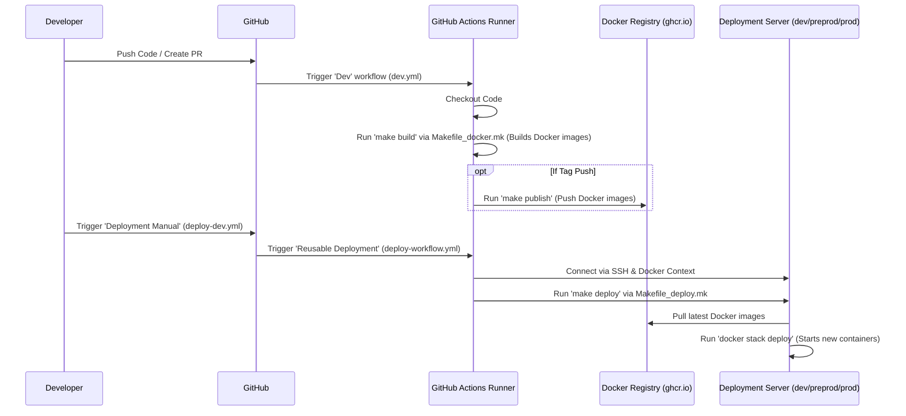

# Chapter 6: Deployment Infrastructure & Automation

Welcome to the final chapter! In [Chapter 5: S2 Event Sourcing & State Management](05_s2_event_sourcing___state_management_.md), we explored how `trace-registry` reliably tracks changes using event sourcing and state machines (S2). We saw how actions like creating or deleting a catalogue are permanently recorded and follow strict rules.

Now, we have all this great code that manages projects, catalogues, rules, and state changes. But how do we take this code from a developer's computer and make it run reliably so that actual users can access `trace-registry`? How do we ensure that when we update the code, the new version gets delivered smoothly and consistently?

This chapter covers the **Deployment Infrastructure & Automation** – the tools and processes used to build, test, and run the `trace-registry` application in different environments.

## What's the Big Idea? An Automated Factory and Delivery System

Imagine `trace-registry` isn't just software, but a complex product like a car, built from many different parts (the microservices: API, database, web interface, authentication service, etc.).

**Central Use Case:** Let's say a developer just finished adding a cool new feature to the project list page. How do we get this new version of the `trace-registry` built, tested, and running on a server so that users can see the new feature, without breaking anything? And how do we do this reliably every time we make a change?

Doing this manually would be slow, error-prone, and hard to repeat. Instead, `trace-registry` uses an automated system:

1.  **Packaging:** Each part of the "car" (each microservice) is carefully packaged into a standard box called a **Docker container**. This box contains everything the part needs to run, ensuring it works the same way anywhere.
2.  **Assembly Line:** An automated assembly line, powered by **GitHub Actions**, takes the raw code, builds these containers, runs some basic checks, and gets them ready for delivery.
3.  **Delivery Trucks:** These containers are then automatically delivered and set up in different "stores" or **environments** (like a testing area 'dev', a final check area 'preprod', and the main showroom 'prod').
4.  **Instructions:** Simple command lists, called **Makefiles**, provide easy shortcuts to trigger steps in this process, like "build all parts" or "deliver to the test store".

This automated factory assembly line and delivery system ensures that the `trace-registry` application is built consistently and deployed reliably, turning raw code into a working service for users.

## Key Concepts: The Building Blocks

Let's look at the main tools and ideas involved:

1.  **Docker & Containers: Standard Shipping Boxes**
    *   **What it is:** Docker is a tool that packages software (like our API or database) and all its dependencies (libraries, settings) into a single, isolated unit called a **container**.
    *   **Think of it like:** A standardized shipping container. You can put anything inside (code, tools, settings), seal it, and be confident it can be shipped and run anywhere that supports these containers (like any modern server). This avoids the classic "it works on my machine!" problem.
    *   **How `trace-registry` uses it:** Each microservice (the API Gateway, the web frontend, the database, the authentication service Keycloak) is packaged into its own Docker container. You'll find instructions for building these containers in files called `Dockerfile` (e.g., `infra/docker/keycloak/Dockerfile`).

2.  **Environments: Different Stores for Different Purposes**
    *   **What it is:** Separate places where the application runs, each with a specific purpose.
    *   **Think of it like:** Different locations for a restaurant chain:
        *   **`dev` (Development):** A test kitchen where developers try out new recipes and changes frequently. It's okay if things break here sometimes.
        *   **`preprod` (Pre-production):** A staging area or dress rehearsal kitchen. It mirrors the real restaurant setup and is used for final testing before opening to the public.
        *   **`prod` (Production):** The actual restaurant where customers eat. This needs to be stable, reliable, and always working perfectly.
    *   **How `trace-registry` uses it:** The automation system can deploy the containers to `dev`, `preprod`, or `prod` environments, often using slightly different configurations (like connecting to a test database in `dev` vs. the real one in `prod`).

3.  **GitHub Actions: The Automated Assembly Line**
    *   **What it is:** A service provided by GitHub that automatically runs workflows (sequences of steps) in response to events (like code being pushed or a pull request being created). It's a form of CI/CD (Continuous Integration / Continuous Deployment).
    *   **Think of it like:** The automated robotic arms and conveyor belts in our car factory. When new parts (code changes) arrive, it automatically triggers the build process, runs tests, packages the containers, and potentially deploys them.
    *   **How `trace-registry` uses it:** Workflows are defined in YAML files within the `.github/workflows/` directory (like `dev.yml`, `deploy-workflow.yml`). These files tell GitHub Actions exactly what steps to run, such as building Docker images or triggering a deployment.

4.  **Makefiles: Simple Recipe Books**
    *   **What it is:** A file (usually named `Makefile`) containing a set of commands grouped under simple names called "targets". It allows developers to run complex sequences of commands with a single, simple instruction.
    *   **Think of it like:** A recipe book in the factory. Instead of listing every single step ("tighten bolt A, weld part B, paint panel C..."), you just say "follow recipe `build_engine`".
    *   **How `trace-registry` uses it:** Files like `Makefile`, `Makefile_docker.mk`, and `Makefile_deploy.mk` contain targets like `build`, `publish`, or `deploy`. Running `make build` in the terminal triggers all the necessary commands defined under the `build` target in the Makefile, simplifying the developer's job.

5.  **Docker Compose / Docker Stack: Orchestrating the Parts**
    *   **What it is:** Tools that help define and run multi-container Docker applications. You describe all the services (containers), networks, and volumes needed for your application in a configuration file (usually `docker-compose.yml`). `docker stack` is used for deploying these applications to a cluster (like Docker Swarm).
    *   **Think of it like:** The master plan or blueprint for assembling the entire car from its individual parts (containers). It specifies which parts are needed and how they connect.
    *   **How `trace-registry` uses it:** Files in `infra/docker-compose-deploy/` define the different services (web, gateway, database, Keycloak, etc.) and how they should run together in a deployed environment. The deployment scripts use `docker stack deploy` based on these files.

## How to Use It: Deploying a New Feature

Let's follow our use case: getting a new feature deployed to the `dev` environment.

**Step 1: Developer Pushes Code**
A developer finishes the new feature and pushes their code changes to GitHub, possibly creating a Pull Request.

**Step 2: GitHub Actions Triggered (CI)**
Pushing code (or creating a PR) automatically triggers the workflow defined in `.github/workflows/dev.yml`.

**Step 3: Build & Test (via GitHub Actions and Makefiles)**
*   GitHub Actions starts a runner (a temporary virtual machine).
*   It checks out the code.
*   It runs tasks defined in the workflow, which often involves calling Makefile targets. For example, it might run jobs like `docker-web`, `docker-gateway`, etc. as defined in `dev.yml`.
*   Each job uses a shared workflow (`uses: komune-io/fixers-gradle/.github/workflows/make-jvm-workflow.yml@...`) which likely executes targets from `Makefile_docker.mk`.
*   Example target in `Makefile_docker.mk` might be `docker-web-build`:

```makefile
# Simplified from Makefile_docker.mk
FRONT_VER_DOCKERFILE := infra/docker/ver-web-app/Dockerfile
FRONT_VER_NAME := ghcr.io/komune-io/trace-registry-web
FRONT_VER_IMG := ${FRONT_VER_NAME}:${VERSION}

docker-web-build:
	@docker build \
		# ... build arguments like tokens and version ...
		-f ${FRONT_VER_DOCKERFILE} -t ${FRONT_VER_IMG} .
```
*   This `make` command tells Docker to build an image for the web frontend using its `Dockerfile`, tagging it with the correct version. GitHub Actions does this for all the necessary services (gateway, scripts, etc.).

**Step 4: Push Containers to Registry (GitHub Actions)**
If the builds are successful, the workflow (especially when triggered by a tag) pushes the newly built Docker images to a container registry (like GitHub Container Registry - `ghcr.io`).

```makefile
# Simplified from Makefile_docker.mk
docker-web-publish:
	@docker push ${FRONT_VER_IMG}
```
*   This `make` command pushes the image built in the previous step to the central registry.

**Step 5: Trigger Deployment (Manual or Automatic)**
Deployment might be triggered automatically on pushes to certain branches (like `main`), or manually by a developer using GitHub Actions' `workflow_dispatch` feature (as seen in `.github/workflows/deploy-dev.yml`).

**Step 6: Deployment Execution (GitHub Actions, Makefiles, Docker Stack)**
*   The deployment workflow (`.github/workflows/deploy-workflow.yml`) runs.
*   It sets up the connection to the target server (e.g., the `dev` environment server) using Docker Context and SSH keys provided as secrets.

```yaml
# Simplified from .github/workflows/deploy-workflow.yml
    - name: Ensure Docker Context Exists
      shell: bash
      run: |
        # ... configures docker context to talk to the remote server ...
        docker context use 100m_${{ inputs.environment }}
```
*   This step ensures the following Docker commands run on the remote deployment server (`dev`, `preprod`, or `prod`).

*   It then calls `make` targets defined in `Makefile_deploy.mk` to deploy different parts of the stack (proxy, connect, registry).

```yaml
# Simplified from .github/workflows/deploy-workflow.yml
    - name: Deploying registy services to ${{ inputs.environment }} environment...
      shell: bash
      run: |
        make -f Makefile_deploy.mk registry deploy
```
*   The `make registry deploy` command likely triggers steps defined in `infra/docker-compose-deploy/dev-compose.mk`.

```makefile
# Simplified from infra/docker-compose-deploy/dev-compose.mk
registry:
	# ... prepares environment ...
	$(MAKE) $(MAKE_OPTS) --no-print-directory exec-common ACTION=$(ACTION) SERVICE=$(SERVICE) SERVICES_ALL="$(DOCKER_COMPOSE_REGISTRY_FILE)"

exec-common:
	# ... sets up network, substitutes variables ...
	# If ACTION is 'deploy', runs 'dev-service-action' for each service
	$(MAKE) $(MAKE_OPTS) --no-print-directory dev-service-action ACTION=deploy SERVICE=$(SERVICE)

dev-service-action:
	# ... checks ACTION ...
	elif [ "$(ACTION)" = "deploy" ]; then \
		docker stack deploy --detach=true --compose-file $(DOCKER_COMPOSE_PATH)/docker-compose-$(SERVICE).yml $(DOCKER_NETWORK); \
	# ... other actions ...
```
*   This sequence of `make` calls ultimately runs `docker stack deploy`. Docker reads the relevant `docker-compose-*.yml` files (which define the services like the API gateway, database, web server for the registry part), pulls the newest images (that we pushed in Step 4), and starts the updated containers on the `dev` server.

**Step 7: Feature Live on Dev**
The new containers are running, and the updated feature is now accessible on the `dev` environment URL!

## Under the Hood: A Peek Inside the Factory

Let's look closer at some of the key configuration files.

**1. Dockerfile (e.g., for Keycloak - Authentication Service):**
This file is the blueprint for building a single container image.

```dockerfile
# Simplified from infra/docker/keycloak/Dockerfile
# Use a pre-built Keycloak image as a base
FROM komune/im-keycloak:${VERSION_CONNECT}

# Copy custom theme files built in a previous stage (skipped here)
COPY --from=build /app/packages/keycloak/... /opt/keycloak/themes/registry-keycloakify/

# Run Keycloak's build command to include the theme
RUN /opt/keycloak/bin/kc.sh build

# Define the command to run when the container starts
ENTRYPOINT ["/opt/keycloak/bin/kc.sh", "start"]
```
*   `FROM`: Specifies the base image to start from.
*   `COPY`: Copies custom theme files into the image.
*   `RUN`: Executes commands during the image build process.
*   `ENTRYPOINT`: Sets the default command to run when a container is started from this image.

**2. GitHub Actions Workflow (`dev.yml`): Triggering Builds**
This workflow defines jobs that run on code pushes or pull requests, often building containers.

```yaml
# Simplified from .github/workflows/dev.yml
name: Dev

on: [push, pull_request, workflow_dispatch] # When to run

jobs:
  # Job to build libraries (simplified)
  libs:
    uses: komune-io/fixers-gradle/.github/workflows/make-jvm-workflow.yml@...
    with:
      make-file: 'Makefile_libs.mk' # Uses a specific makefile

  # Job to build the web container
  docker-web:
    uses: komune-io/fixers-gradle/.github/workflows/make-jvm-workflow.yml@...
    with:
      make-file: 'Makefile_docker.mk' # Uses the docker makefile
      make-build-task: 'docker-web-build' # Runs 'make docker-web-build'
      make-publish-task: 'docker-web-publish' # Runs 'make docker-web-publish' on tags
      # ... secrets for registry login ...

  # Similar jobs for docker-gateway, docker-script, etc.
```
*   `on:` Defines triggers for the workflow.
*   `jobs:` Contains different stages or tasks.
*   `uses:` Reuses another workflow template, passing specific parameters like which `Makefile` and which `make` target (`make-build-task`) to run. This promotes consistency.

**3. GitHub Actions Workflow (`deploy-workflow.yml`): Reusable Deployment Logic**
This is a *reusable* workflow called by others (like `deploy-dev.yml`) to perform the actual deployment steps.

```yaml
# Simplified from .github/workflows/deploy-workflow.yml
name: Reusable Deployment Workflow

on:
  workflow_call: # Makes this workflow callable by others
    inputs:
      environment: # Expects environment name (dev, preprod, prod)
        required: true
        type: string
    secrets: # Expects secrets needed for deployment
      DOCKER_CONTEXT_SSH_KEY: required: true
      # ... other secrets for server access, passwords, etc. ...

jobs:
  deploy:
    runs-on: ubuntu-latest
    environment: ${{ inputs.environment }} # Sets environment context (for secrets/vars)
    steps:
      - name: Checkout Repository # Gets the code
        uses: actions/checkout@v3
      - name: Setup SSH Agent # Configures SSH key for server access
        uses: webfactory/ssh-agent@v0.9.0
        with:
          ssh-private-key: ${{ secrets.DOCKER_CONTEXT_SSH_KEY }}
      - name: Ensure Docker Context Exists # Configures Docker to target remote server
        # ... runs docker context create/use ...
      - name: Deploying proxy services # Calls make to deploy proxy
        run: make -f Makefile_deploy.mk proxy deploy
      - name: Deploying connect services # Calls make to deploy 'connect' stack
        run: make -f Makefile_deploy.mk connect deploy
      - name: Deploying registry services # Calls make to deploy 'registry' stack
        run: make -f Makefile_deploy.mk registry deploy
```
*   `on: workflow_call`: Defines this as a reusable workflow.
*   `inputs:` / `secrets:`: Declares parameters and secrets it needs from the calling workflow.
*   `steps:` The sequence of actions: checkout code, set up SSH, configure Docker context, run `make deploy` for different service groups using `Makefile_deploy.mk`.

**4. Deployment Trigger (`deploy-dev.yml`)**
This workflow provides a manual trigger to start a deployment using the reusable workflow.

```yaml
# Simplified from .github/workflows/deploy-dev.yml
name: Deployment Manual

on:
  workflow_dispatch: # Allows manual triggering from GitHub UI
    inputs:
      environment: # User selects dev, preprod, or prod
        required: true
        default: 'dev'
      run_reset: # Option to reset environment (non-prod)
        required: true
        type: boolean

jobs:
  dev-deploy:
    name: Deploy to ${{ github.event.inputs.environment }}
    uses: ./.github/workflows/deploy-workflow.yml # Calls the reusable workflow
    secrets: inherit # Passes all necessary secrets down
    with:
      environment: ${{ github.event.inputs.environment }} # Passes the chosen environment
      run_reset: ${{ github.event.inputs.run_reset }}
```
*   `on: workflow_dispatch`: Enables the "Run workflow" button in GitHub Actions.
*   `inputs:` Defines the options presented to the user (environment selection).
*   `uses: ./.github/workflows/deploy-workflow.yml`: Calls the reusable deployment workflow, passing the selected environment and secrets.

**Overall Flow Diagram:**



This automated pipeline ensures that code changes are systematically built, packaged, and deployed, reducing manual effort and increasing reliability.

## Conclusion

In this final chapter, you've learned about the critical infrastructure and automation that brings `trace-registry` to life:

*   **Docker** packages each microservice into consistent, portable **Containers**.
*   **GitHub Actions** provides the automated **CI/CD pipeline** (the assembly line) to build, test, and deploy these containers.
*   **Makefiles** offer simplified commands (recipes) to trigger common build and deployment tasks.
*   **Docker Compose/Stack** defines how the multiple containers run together in different **Environments** (`dev`, `preprod`, `prod`).
*   Workflows in `.github/workflows/` (like `dev.yml`, `deploy-workflow.yml`) orchestrate this entire process, using Makefiles (`Makefile_docker.mk`, `Makefile_deploy.mk`) and Docker configuration (`infra/docker-compose-deploy/`, `infra/docker/`).

This automation is essential for maintaining a reliable and efficient development and deployment process for a complex application like `trace-registry`. It ensures that the system described in the previous chapters ([Projects & Assets](01_project___asset_management_.md), [Catalogues](02_catalogue___dataset_management__dcat_dcat_ap__.md), [Rules/Evidence](03_cccev__core_criterion_and_core_evidence_vocabulary__.md), [APIs](04_f2_function_based_apis_.md), and [State Management](05_s2_event_sourcing___state_management_.md)) can be consistently delivered to users.

This concludes our tour through the core concepts of the `trace-registry` project! We hope this gives you a solid foundation for understanding how it works.

---

Generated by [AI Codebase Knowledge Builder](https://github.com/The-Pocket/Tutorial-Codebase-Knowledge)