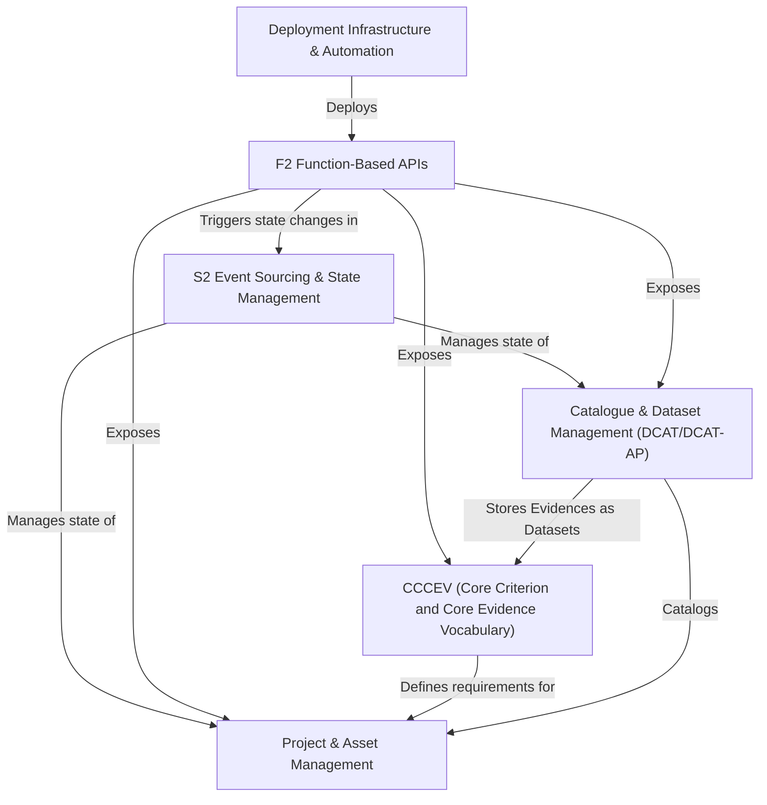

# Tutorial: trace-registry

The `trace-registry` project is a sophisticated digital system for managing and tracking information about **projects**, particularly *environmental initiatives*, and their associated **assets** like *carbon credits or certificates*. It achieves this by organizing data into **Catalogues** (akin to library sections) and **Datasets** (specific information items), using standardized metadata formats like *DCAT/DCAT-AP* for discoverability.

The system's architecture relies on **S2 Event Sourcing** to record every change as an *immutable event*, providing a full audit trail and enabling the reconstruction of current states for entities like Catalogues and Projects. Backend functionalities are primarily exposed through **F2 Function-Based APIs**, which handle specific *commands* (to perform actions) and *queries* (to request information) in an event-driven manner.

For managing compliance and verification, the project incorporates the **CCCEV (Core Criterion and Core Evidence Vocabulary)** standard, allowing the definition of *Requirements* and the linking of *Evidences* to demonstrate fulfillment. The entire application, composed of various microservices, is built, tested, and deployed using **automated infrastructure** leveraging Docker, GitHub Actions, and Makefiles.

**Source Repository:** [https://github.com/komune-io/trace-registry](https://github.com/komune-io/trace-registry)

## Chapters

1. [Project & Asset Management
](01_project___asset_management_.md)
2. [Catalogue & Dataset Management (DCAT/DCAT-AP)
](02_catalogue___dataset_management__dcat_dcat_ap__.md)
3. [CCCEV (Core Criterion and Core Evidence Vocabulary)
](03_cccev__core_criterion_and_core_evidence_vocabulary__.md)
4. [F2 Function-Based APIs
](04_f2_function_based_apis_.md)
5. [S2 Event Sourcing & State Management
](05_s2_event_sourcing___state_management_.md)
6. [Deployment Infrastructure & Automation
](06_deployment_infrastructure___automation_.md)

---

Generated by [AI Codebase Knowledge Builder](https://github.com/The-Pocket/Tutorial-Codebase-Knowledge)